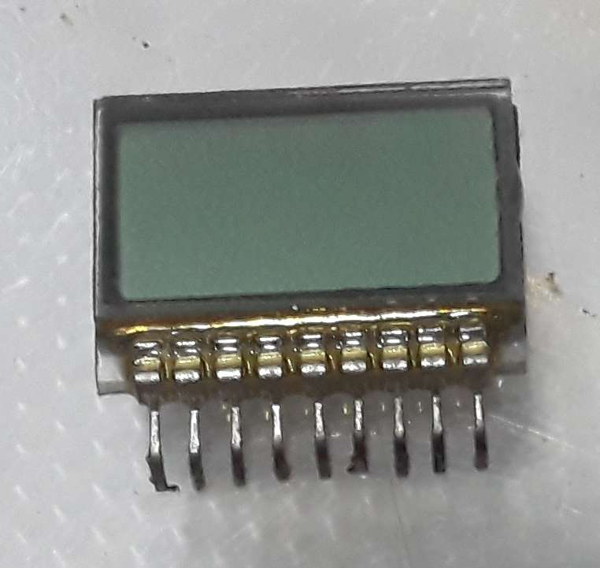
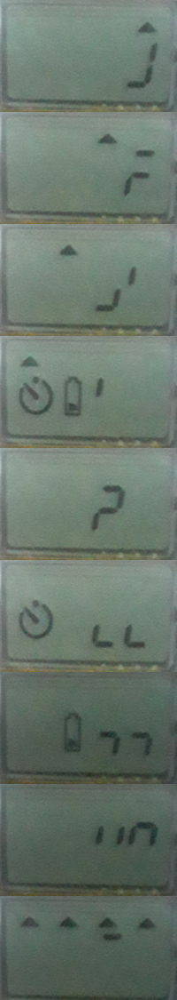
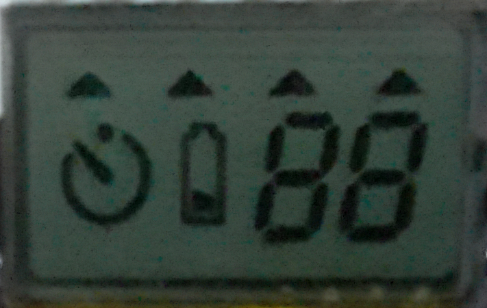

# Display LCD (Cámara/Multiplexado)



Display recuperado de una cámara se buscara realizar ingeniería inversa para hacerlo funcional. No se tiene el modelo de la cámara, información util de la placa, ni identificación en el LCD.

## Montaje

El LCD dispone de 9 pines con un pitch (separación) ~1.5mm, el cual es muy pequeño para una placa de pruebas (breadboard), por lo que se dispone de un PCB para adaptarlo a pin header de 2.54mm (tamaño mas estándar).

Para identificar correctamente los pines de un display LCD segmentado, se puede inducir una señal de corriente alterna (AC) en uno de los pines mientras se dejan el resto al aire (sin conectar). Observando la respuesta de los segmentos, se puede determinar a qué segmento corresponde cada pin, ya que sólo los pines asociados al segmento conectarán la señal inducida.

## AC con un microcontrolador

Los displays LCD de segmentos requieren ser excitados únicamente con señales AC; la aplicación de tensión DC, incluso de bajo voltaje, puede degradar permanentemente la pantalla al provocar electro-migración en los electrodos transparentes (por ejemplo, de ITO).

Los microcontroladores suelen contar con salidas digitales, las cuales solo pueden entregar niveles lógicos (por ejemplo, 0V y +5V). Si se genera una señal cuadrada alternando entre estos valores con referencia a tierra (GND ↔ PIN), el resultado es una señal AC desplazada respecto a GND, cuyo valor promedio no es cero (su forma efectiva sería algo así como (VCC/2  **AC** + VCC/2 **DC**). Esto sigue generando una componente DC perjudicial para el display.

Para obtener una señal AC pura (valor promedio cero), es necesario que los dos terminales del segmento reciban señales complementarias. Así, en lugar de referenciar cada pin respecto a GND, se mide la diferencia de potencial entre dos pines (PIN A y PIN B), aplicando señales cuadradas de lógica opuesta. Por ejemplo, asumiendo una alimentación de 5V, la tabla de combinaciones sería:

| PIN A | PIN B | Diferencia A-B |
| :---  | :---  | ---: |
| 0     | 0     | 0v |
| 0     | 1     | 5v |
| 1     | 0     | -5v |
| 1     | 1     | 0v |

De esta forma, la tensión aplicada entre ambos extremos del segmento alterna simétricamente entre +5V y -5V y su valor promedio es cero, cumpliendo la condición de una señal AC pura. El segmento se enciende cuando la diferencia potencial es mayor en módulo que el umbral del LCD, pero sin componente DC que dañe el cristal.

Se genera el siguiente código para un Arduino UNO, el cual genera un común

::: code-group

```cpp [ACTest.cc]
#ifndef __AVR_ATmega328P__
#define __AVR_ATmega328P__
#endif

#ifndef F_CPU
#define F_CPU 16000000ULL
#endif

#include <avr/io.h>
#include <util/delay.h>

#define AC_FREQ 120

#define CHANGE_TIME 5 // seconds
#define DELAY_AC (500.0 / AC_FREQ)

#define CHANGE_COUNT 2*((uint16_t)((CHANGE_TIME * 1000.0) / (2.0 * DELAY_AC)))

int main(void) {
    DDRD = 0xFF;
    DDRB |= (1 << DDB0);

    uint8_t com_pin = 0;

    while (1) {
        if (com_pin == 8) {
          PORTB |= (1 << DDB0);
          PORTD = 0x00;
        } else {
          PORTB &= ~(1 << DDB0);
          PORTD = (1 << com_pin++);

        }
        for (uint16_t i = 0; i < CHANGE_COUNT; i++) {

            PORTD = ~PORTD;
            PORTB ^= (1 << PORTB0);

            _delay_ms(DELAY_AC);

        }
        if (com_pin > 7) {
            com_pin = 0;
        }
    }

    return 0;
}
```

::: tip
No se utiliza PWM ya que el atmega328p no posee tantos puertos capaces de hacer PWM, esto en otros microcontroladores es posible. El costo agregado solo vale la pena si se requiere computo mientras se muestran los digitos o si la multiplexacion es mas extensa
:::

## Identificado de pines y segmentos

Con el código anterior se obtiene

 

20 segmentos lo que indica que se multiplexa con 4 pines comunes y 5 pines de segmento, o vice versa.
