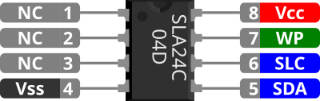

# SLA24C (AVR driver)

[Código Github](https://github.com/jackestar/Baremetal/tree/main/AVR/SLX24C04)

Memoria EEPROM de 4 Kbit (512 × 8 bit) Serial CMOS-EEPROM con I2C sincrónico de la marca SIEMENS

## Pinout



| Nro | Pin | Función |
| :---: | :---: | :--- |
| 1 | NC | CS0 |
| 2 | NC | CS1 |
| 3 | NC | CS2 |
| 4 | Vss | Alimentación - (GND) |
| 5 | SDA | Serial bidirectional data bus |
| 6 | SCL | Serial clock input |
| 7 | WP  | Entrada protección contra escritura |
| 8 | Vcc | Alimentación + |

::: tip
En la ultima revision del datasheet los pines 1,2,3 fueron marcados como NC, originalmente funcionaban para seleccionar que chip esta activo (en el caso de tener varios) se asume que su función desaparece al usarse I2C
:::

## I2C

Se configura el I2C para términos del microcontrolador TWI (Two-Wire Interface)

Se establece la velocidad de la comunicación, se utilizan preprocesadores para facilitar su configuración

```cpp

#define SLC_FREQ 400e3
#define PRESCALER 1
#define TW_RATE  (F_CPU/SLC_FREQ - 16)/(2 * PRESCALER)

```

