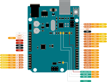

# Blink build-in LED

[Código Github](https://github.com/jackestar/Baremetal/tree/main/BlinkLED)

El programa mas básico para comprobar el funcionamiento en una placa de desarrollo. Hacer parpadear a intervalos regulados el LED integrado.

## Arduino

Todos conocen el tradicional programa para hacer que el led integrado de un Arduino parpadee.

```C
void setup() {
  pinMode(LED_BUILTIN, OUTPUT);
}

void loop() {
  digitalWrite(LED_BUILTIN, HIGH);
  delay(1000);
  digitalWrite(LED_BUILTIN, LOW);
  delay(1000);
}
```

este se plantea en cinco pasos:
* encender el led
* esperar 1seg
* apagar el led
* esperar 1seg
* repetir

pero no necesariamente es la forma mas optima de hacerlo (en términos de Arduino), el programa se puede plantear de la siguiente manera:

* cambiar el estado del led respecto su estado anterior
* esperar 1seg
* repetir


```c
void setup() {
  pinMode(LED_BUILTIN, OUTPUT);
}

void loop() {
  digitalWrite(LED_BUILTIN, !digitalRead(LED_BUILTIN));
  delay(1000);
}
```

### Resultado en ASM

<div class="longBlock">

**Para el codigo original**

```asm:line-numbers
00000000 <.sec1>:
   0:	0c 94 5c 00 	jmp	0xb8	;  0xb8
   4:	0c 94 6e 00 	jmp	0xdc	;  0xdc
   8:	0c 94 6e 00 	jmp	0xdc	;  0xdc
   c:	0c 94 6e 00 	jmp	0xdc	;  0xdc
  10:	0c 94 6e 00 	jmp	0xdc	;  0xdc
  14:	0c 94 6e 00 	jmp	0xdc	;  0xdc
  18:	0c 94 6e 00 	jmp	0xdc	;  0xdc
  1c:	0c 94 6e 00 	jmp	0xdc	;  0xdc
  20:	0c 94 6e 00 	jmp	0xdc	;  0xdc
  24:	0c 94 6e 00 	jmp	0xdc	;  0xdc
  28:	0c 94 6e 00 	jmp	0xdc	;  0xdc
  2c:	0c 94 6e 00 	jmp	0xdc	;  0xdc
  30:	0c 94 6e 00 	jmp	0xdc	;  0xdc
  34:	0c 94 6e 00 	jmp	0xdc	;  0xdc
  38:	0c 94 6e 00 	jmp	0xdc	;  0xdc
  3c:	0c 94 6e 00 	jmp	0xdc	;  0xdc
  40:	0c 94 13 01 	jmp	0x226	;  0x226
  44:	0c 94 6e 00 	jmp	0xdc	;  0xdc
  48:	0c 94 6e 00 	jmp	0xdc	;  0xdc
  4c:	0c 94 6e 00 	jmp	0xdc	;  0xdc
  50:	0c 94 6e 00 	jmp	0xdc	;  0xdc
  54:	0c 94 6e 00 	jmp	0xdc	;  0xdc
  58:	0c 94 6e 00 	jmp	0xdc	;  0xdc
  5c:	0c 94 6e 00 	jmp	0xdc	;  0xdc
  60:	0c 94 6e 00 	jmp	0xdc	;  0xdc
  64:	0c 94 6e 00 	jmp	0xdc	;  0xdc
  68:	00 00       	nop
  6a:	00 00       	nop
  6c:	24 00       	.word	0x0024	; ????
  6e:	27 00       	.word	0x0027	; ????
  70:	2a 00       	.word	0x002a	; ????
  72:	00 00       	nop
  74:	00 00       	nop
  76:	25 00       	.word	0x0025	; ????
  78:	28 00       	.word	0x0028	; ????
  7a:	2b 00       	.word	0x002b	; ????
  7c:	04 04       	cpc	r0, r4
  7e:	04 04       	cpc	r0, r4
  80:	04 04       	cpc	r0, r4
  82:	04 04       	cpc	r0, r4
  84:	02 02       	muls	r16, r18
  86:	02 02       	muls	r16, r18
  88:	02 02       	muls	r16, r18
  8a:	03 03       	mulsu	r16, r19
  8c:	03 03       	mulsu	r16, r19
  8e:	03 03       	mulsu	r16, r19
  90:	01 02       	muls	r16, r17
  92:	04 08       	sbc	r0, r4
  94:	10 20       	and	r1, r0
  96:	40 80       	ld	r4, Z
  98:	01 02       	muls	r16, r17
  9a:	04 08       	sbc	r0, r4
  9c:	10 20       	and	r1, r0
  9e:	01 02       	muls	r16, r17
  a0:	04 08       	sbc	r0, r4
  a2:	10 20       	and	r1, r0
  a4:	00 00       	nop
  a6:	00 08       	sbc	r0, r0
  a8:	00 02       	muls	r16, r16
  aa:	01 00       	.word	0x0001	; ????
  ac:	00 03       	mulsu	r16, r16
  ae:	04 07       	cpc	r16, r20
	...
  b8:	11 24       	eor	r1, r1
  ba:	1f be       	out	0x3f, r1	; 63
  bc:	cf ef       	ldi	r28, 0xFF	; 255
  be:	d8 e0       	ldi	r29, 0x08	; 8
  c0:	de bf       	out	0x3e, r29	; 62
  c2:	cd bf       	out	0x3d, r28	; 61
  c4:	21 e0       	ldi	r18, 0x01	; 1
  c6:	a0 e0       	ldi	r26, 0x00	; 0
  c8:	b1 e0       	ldi	r27, 0x01	; 1
  ca:	01 c0       	rjmp	.+2      	;  0xce
  cc:	1d 92       	st	X+, r1
  ce:	a9 30       	cpi	r26, 0x09	; 9
  d0:	b2 07       	cpc	r27, r18
  d2:	e1 f7       	brne	.-8      	;  0xcc
  d4:	0e 94 5d 01 	call	0x2ba	;  0x2ba
  d8:	0c 94 cc 01 	jmp	0x398	;  0x398
  dc:	0c 94 00 00 	jmp	0	;  0x0
  e0:	e1 eb       	ldi	r30, 0xB1	; 177
  e2:	f0 e0       	ldi	r31, 0x00	; 0
  e4:	24 91       	lpm	r18, Z
  e6:	ed e9       	ldi	r30, 0x9D	; 157
  e8:	f0 e0       	ldi	r31, 0x00	; 0
  ea:	94 91       	lpm	r25, Z
  ec:	e9 e8       	ldi	r30, 0x89	; 137
  ee:	f0 e0       	ldi	r31, 0x00	; 0
  f0:	e4 91       	lpm	r30, Z
  f2:	ee 23       	and	r30, r30
  f4:	c9 f0       	breq	.+50     	;  0x128
  f6:	22 23       	and	r18, r18
  f8:	39 f0       	breq	.+14     	;  0x108
  fa:	23 30       	cpi	r18, 0x03	; 3
  fc:	01 f1       	breq	.+64     	;  0x13e
  fe:	a8 f4       	brcc	.+42     	;  0x12a
 100:	21 30       	cpi	r18, 0x01	; 1
 102:	19 f1       	breq	.+70     	;  0x14a
 104:	22 30       	cpi	r18, 0x02	; 2
 106:	29 f1       	breq	.+74     	;  0x152
 108:	f0 e0       	ldi	r31, 0x00	; 0
 10a:	ee 0f       	add	r30, r30
 10c:	ff 1f       	adc	r31, r31
 10e:	ee 58       	subi	r30, 0x8E	; 142
 110:	ff 4f       	sbci	r31, 0xFF	; 255
 112:	a5 91       	lpm	r26, Z+
 114:	b4 91       	lpm	r27, Z
 116:	2f b7       	in	r18, 0x3f	; 63
 118:	f8 94       	cli
 11a:	ec 91       	ld	r30, X
 11c:	81 11       	cpse	r24, r1
 11e:	26 c0       	rjmp	.+76     	;  0x16c
 120:	90 95       	com	r25
 122:	9e 23       	and	r25, r30
 124:	9c 93       	st	X, r25
 126:	2f bf       	out	0x3f, r18	; 63
 128:	08 95       	ret
 12a:	27 30       	cpi	r18, 0x07	; 7
 12c:	a9 f0       	breq	.+42     	;  0x158
 12e:	28 30       	cpi	r18, 0x08	; 8
 130:	c9 f0       	breq	.+50     	;  0x164
 132:	24 30       	cpi	r18, 0x04	; 4
 134:	49 f7       	brne	.-46     	;  0x108
 136:	20 91 80 00 	lds	r18, 0x0080	;  0x800080
 13a:	2f 7d       	andi	r18, 0xDF	; 223
 13c:	03 c0       	rjmp	.+6      	;  0x144
 13e:	20 91 80 00 	lds	r18, 0x0080	;  0x800080
 142:	2f 77       	andi	r18, 0x7F	; 127
 144:	20 93 80 00 	sts	0x0080, r18	;  0x800080
 148:	df cf       	rjmp	.-66     	;  0x108
 14a:	24 b5       	in	r18, 0x24	; 36
 14c:	2f 77       	andi	r18, 0x7F	; 127
 14e:	24 bd       	out	0x24, r18	; 36
 150:	db cf       	rjmp	.-74     	;  0x108
 152:	24 b5       	in	r18, 0x24	; 36
 154:	2f 7d       	andi	r18, 0xDF	; 223
 156:	fb cf       	rjmp	.-10     	;  0x14e
 158:	20 91 b0 00 	lds	r18, 0x00B0	;  0x8000b0
 15c:	2f 77       	andi	r18, 0x7F	; 127
 15e:	20 93 b0 00 	sts	0x00B0, r18	;  0x8000b0
 162:	d2 cf       	rjmp	.-92     	;  0x108
 164:	20 91 b0 00 	lds	r18, 0x00B0	;  0x8000b0
 168:	2f 7d       	andi	r18, 0xDF	; 223
 16a:	f9 cf       	rjmp	.-14     	;  0x15e
 16c:	9e 2b       	or	r25, r30
 16e:	da cf       	rjmp	.-76     	;  0x124
 170:	3f b7       	in	r19, 0x3f	; 63
 172:	f8 94       	cli
 174:	80 91 05 01 	lds	r24, 0x0105	;  0x800105
 178:	90 91 06 01 	lds	r25, 0x0106	;  0x800106
 17c:	a0 91 07 01 	lds	r26, 0x0107	;  0x800107
 180:	b0 91 08 01 	lds	r27, 0x0108	;  0x800108
 184:	26 b5       	in	r18, 0x26	; 38
 186:	a8 9b       	sbis	0x15, 0	; 21
 188:	05 c0       	rjmp	.+10     	;  0x194
 18a:	2f 3f       	cpi	r18, 0xFF	; 255
 18c:	19 f0       	breq	.+6      	;  0x194
 18e:	01 96       	adiw	r24, 0x01	; 1
 190:	a1 1d       	adc	r26, r1
 192:	b1 1d       	adc	r27, r1
 194:	3f bf       	out	0x3f, r19	; 63
 196:	ba 2f       	mov	r27, r26
 198:	a9 2f       	mov	r26, r25
 19a:	98 2f       	mov	r25, r24
 19c:	88 27       	eor	r24, r24
 19e:	bc 01       	movw	r22, r24
 1a0:	cd 01       	movw	r24, r26
 1a2:	62 0f       	add	r22, r18
 1a4:	71 1d       	adc	r23, r1
 1a6:	81 1d       	adc	r24, r1
 1a8:	91 1d       	adc	r25, r1
 1aa:	42 e0       	ldi	r20, 0x02	; 2
 1ac:	66 0f       	add	r22, r22
 1ae:	77 1f       	adc	r23, r23
 1b0:	88 1f       	adc	r24, r24
 1b2:	99 1f       	adc	r25, r25
 1b4:	4a 95       	dec	r20
 1b6:	d1 f7       	brne	.-12     	;  0x1ac
 1b8:	08 95       	ret
 1ba:	8f 92       	push	r8
 1bc:	9f 92       	push	r9
 1be:	af 92       	push	r10
 1c0:	bf 92       	push	r11
 1c2:	cf 92       	push	r12
 1c4:	df 92       	push	r13
 1c6:	ef 92       	push	r14
 1c8:	ff 92       	push	r15
 1ca:	0e 94 b8 00 	call	0x170	;  0x170
 1ce:	4b 01       	movw	r8, r22
 1d0:	5c 01       	movw	r10, r24
 1d2:	88 ee       	ldi	r24, 0xE8	; 232
 1d4:	c8 2e       	mov	r12, r24
 1d6:	83 e0       	ldi	r24, 0x03	; 3
 1d8:	d8 2e       	mov	r13, r24
 1da:	e1 2c       	mov	r14, r1
 1dc:	f1 2c       	mov	r15, r1
 1de:	0e 94 b8 00 	call	0x170	;  0x170
 1e2:	68 19       	sub	r22, r8
 1e4:	79 09       	sbc	r23, r9
 1e6:	8a 09       	sbc	r24, r10
 1e8:	9b 09       	sbc	r25, r11
 1ea:	68 3e       	cpi	r22, 0xE8	; 232
 1ec:	73 40       	sbci	r23, 0x03	; 3
 1ee:	81 05       	cpc	r24, r1
 1f0:	91 05       	cpc	r25, r1
 1f2:	a8 f3       	brcs	.-22     	;  0x1de
 1f4:	21 e0       	ldi	r18, 0x01	; 1
 1f6:	c2 1a       	sub	r12, r18
 1f8:	d1 08       	sbc	r13, r1
 1fa:	e1 08       	sbc	r14, r1
 1fc:	f1 08       	sbc	r15, r1
 1fe:	88 ee       	ldi	r24, 0xE8	; 232
 200:	88 0e       	add	r8, r24
 202:	83 e0       	ldi	r24, 0x03	; 3
 204:	98 1e       	adc	r9, r24
 206:	a1 1c       	adc	r10, r1
 208:	b1 1c       	adc	r11, r1
 20a:	c1 14       	cp	r12, r1
 20c:	d1 04       	cpc	r13, r1
 20e:	e1 04       	cpc	r14, r1
 210:	f1 04       	cpc	r15, r1
 212:	29 f7       	brne	.-54     	;  0x1de
 214:	ff 90       	pop	r15
 216:	ef 90       	pop	r14
 218:	df 90       	pop	r13
 21a:	cf 90       	pop	r12
 21c:	bf 90       	pop	r11
 21e:	af 90       	pop	r10
 220:	9f 90       	pop	r9
 222:	8f 90       	pop	r8
 224:	08 95       	ret
 226:	1f 92       	push	r1
 228:	0f 92       	push	r0
 22a:	0f b6       	in	r0, 0x3f	; 63
 22c:	0f 92       	push	r0
 22e:	11 24       	eor	r1, r1
 230:	2f 93       	push	r18
 232:	3f 93       	push	r19
 234:	8f 93       	push	r24
 236:	9f 93       	push	r25
 238:	af 93       	push	r26
 23a:	bf 93       	push	r27
 23c:	80 91 01 01 	lds	r24, 0x0101	;  0x800101
 240:	90 91 02 01 	lds	r25, 0x0102	;  0x800102
 244:	a0 91 03 01 	lds	r26, 0x0103	;  0x800103
 248:	b0 91 04 01 	lds	r27, 0x0104	;  0x800104
 24c:	30 91 00 01 	lds	r19, 0x0100	;  0x800100
 250:	23 e0       	ldi	r18, 0x03	; 3
 252:	23 0f       	add	r18, r19
 254:	2d 37       	cpi	r18, 0x7D	; 125
 256:	58 f5       	brcc	.+86     	;  0x2ae
 258:	01 96       	adiw	r24, 0x01	; 1
 25a:	a1 1d       	adc	r26, r1
 25c:	b1 1d       	adc	r27, r1
 25e:	20 93 00 01 	sts	0x0100, r18	;  0x800100
 262:	80 93 01 01 	sts	0x0101, r24	;  0x800101
 266:	90 93 02 01 	sts	0x0102, r25	;  0x800102
 26a:	a0 93 03 01 	sts	0x0103, r26	;  0x800103
 26e:	b0 93 04 01 	sts	0x0104, r27	;  0x800104
 272:	80 91 05 01 	lds	r24, 0x0105	;  0x800105
 276:	90 91 06 01 	lds	r25, 0x0106	;  0x800106
 27a:	a0 91 07 01 	lds	r26, 0x0107	;  0x800107
 27e:	b0 91 08 01 	lds	r27, 0x0108	;  0x800108
 282:	01 96       	adiw	r24, 0x01	; 1
 284:	a1 1d       	adc	r26, r1
 286:	b1 1d       	adc	r27, r1
 288:	80 93 05 01 	sts	0x0105, r24	;  0x800105
 28c:	90 93 06 01 	sts	0x0106, r25	;  0x800106
 290:	a0 93 07 01 	sts	0x0107, r26	;  0x800107
 294:	b0 93 08 01 	sts	0x0108, r27	;  0x800108
 298:	bf 91       	pop	r27
 29a:	af 91       	pop	r26
 29c:	9f 91       	pop	r25
 29e:	8f 91       	pop	r24
 2a0:	3f 91       	pop	r19
 2a2:	2f 91       	pop	r18
 2a4:	0f 90       	pop	r0
 2a6:	0f be       	out	0x3f, r0	; 63
 2a8:	0f 90       	pop	r0
 2aa:	1f 90       	pop	r1
 2ac:	18 95       	reti
 2ae:	26 e8       	ldi	r18, 0x86	; 134
 2b0:	23 0f       	add	r18, r19
 2b2:	02 96       	adiw	r24, 0x02	; 2
 2b4:	a1 1d       	adc	r26, r1
 2b6:	b1 1d       	adc	r27, r1
 2b8:	d2 cf       	rjmp	.-92     	;  0x25e
 2ba:	78 94       	sei
 2bc:	84 b5       	in	r24, 0x24	; 36
 2be:	82 60       	ori	r24, 0x02	; 2
 2c0:	84 bd       	out	0x24, r24	; 36
 2c2:	84 b5       	in	r24, 0x24	; 36
 2c4:	81 60       	ori	r24, 0x01	; 1
 2c6:	84 bd       	out	0x24, r24	; 36
 2c8:	85 b5       	in	r24, 0x25	; 37
 2ca:	82 60       	ori	r24, 0x02	; 2
 2cc:	85 bd       	out	0x25, r24	; 37
 2ce:	85 b5       	in	r24, 0x25	; 37
 2d0:	81 60       	ori	r24, 0x01	; 1
 2d2:	85 bd       	out	0x25, r24	; 37
 2d4:	80 91 6e 00 	lds	r24, 0x006E	;  0x80006e
 2d8:	81 60       	ori	r24, 0x01	; 1
 2da:	80 93 6e 00 	sts	0x006E, r24	;  0x80006e
 2de:	10 92 81 00 	sts	0x0081, r1	;  0x800081
 2e2:	80 91 81 00 	lds	r24, 0x0081	;  0x800081
 2e6:	82 60       	ori	r24, 0x02	; 2
 2e8:	80 93 81 00 	sts	0x0081, r24	;  0x800081
 2ec:	80 91 81 00 	lds	r24, 0x0081	;  0x800081
 2f0:	81 60       	ori	r24, 0x01	; 1
 2f2:	80 93 81 00 	sts	0x0081, r24	;  0x800081
 2f6:	80 91 80 00 	lds	r24, 0x0080	;  0x800080
 2fa:	81 60       	ori	r24, 0x01	; 1
 2fc:	80 93 80 00 	sts	0x0080, r24	;  0x800080
 300:	80 91 b1 00 	lds	r24, 0x00B1	;  0x8000b1
 304:	84 60       	ori	r24, 0x04	; 4
 306:	80 93 b1 00 	sts	0x00B1, r24	;  0x8000b1
 30a:	80 91 b0 00 	lds	r24, 0x00B0	;  0x8000b0
 30e:	81 60       	ori	r24, 0x01	; 1
 310:	80 93 b0 00 	sts	0x00B0, r24	;  0x8000b0
 314:	80 91 7a 00 	lds	r24, 0x007A	;  0x80007a
 318:	84 60       	ori	r24, 0x04	; 4
 31a:	80 93 7a 00 	sts	0x007A, r24	;  0x80007a
 31e:	80 91 7a 00 	lds	r24, 0x007A	;  0x80007a
 322:	82 60       	ori	r24, 0x02	; 2
 324:	80 93 7a 00 	sts	0x007A, r24	;  0x80007a
 328:	80 91 7a 00 	lds	r24, 0x007A	;  0x80007a
 32c:	81 60       	ori	r24, 0x01	; 1
 32e:	80 93 7a 00 	sts	0x007A, r24	;  0x80007a
 332:	80 91 7a 00 	lds	r24, 0x007A	;  0x80007a
 336:	80 68       	ori	r24, 0x80	; 128
 338:	80 93 7a 00 	sts	0x007A, r24	;  0x80007a
 33c:	10 92 c1 00 	sts	0x00C1, r1	;  0x8000c1
 340:	ed e9       	ldi	r30, 0x9D	; 157
 342:	f0 e0       	ldi	r31, 0x00	; 0
 344:	24 91       	lpm	r18, Z
 346:	e9 e8       	ldi	r30, 0x89	; 137
 348:	f0 e0       	ldi	r31, 0x00	; 0
 34a:	84 91       	lpm	r24, Z
 34c:	88 23       	and	r24, r24
 34e:	99 f0       	breq	.+38     	;  0x376
 350:	90 e0       	ldi	r25, 0x00	; 0
 352:	88 0f       	add	r24, r24
 354:	99 1f       	adc	r25, r25
 356:	fc 01       	movw	r30, r24
 358:	e8 59       	subi	r30, 0x98	; 152
 35a:	ff 4f       	sbci	r31, 0xFF	; 255
 35c:	a5 91       	lpm	r26, Z+
 35e:	b4 91       	lpm	r27, Z
 360:	fc 01       	movw	r30, r24
 362:	ee 58       	subi	r30, 0x8E	; 142
 364:	ff 4f       	sbci	r31, 0xFF	; 255
 366:	85 91       	lpm	r24, Z+
 368:	94 91       	lpm	r25, Z
 36a:	8f b7       	in	r24, 0x3f	; 63
 36c:	f8 94       	cli
 36e:	ec 91       	ld	r30, X
 370:	e2 2b       	or	r30, r18
 372:	ec 93       	st	X, r30
 374:	8f bf       	out	0x3f, r24	; 63
 376:	c0 e0       	ldi	r28, 0x00	; 0
 378:	d0 e0       	ldi	r29, 0x00	; 0
 37a:	81 e0       	ldi	r24, 0x01	; 1
 37c:	0e 94 70 00 	call	0xe0	;  0xe0
 380:	0e 94 dd 00 	call	0x1ba	;  0x1ba
 384:	80 e0       	ldi	r24, 0x00	; 0
 386:	0e 94 70 00 	call	0xe0	;  0xe0
 38a:	0e 94 dd 00 	call	0x1ba	;  0x1ba
 38e:	20 97       	sbiw	r28, 0x00	; 0
 390:	a1 f3       	breq	.-24     	;  0x37a
 392:	0e 94 00 00 	call	0	;  0x0
 396:	f1 cf       	rjmp	.-30     	;  0x37a
 398:	f8 94       	cli
 39a:	ff cf       	rjmp	.-2      	;  0x39a
```

**Para el codigo optimizado**

```asm:line-numbers
00000000 <.sec1>:
   0:	0c 94 61 00 	jmp	0xc2	;  0xc2
   4:	0c 94 73 00 	jmp	0xe6	;  0xe6
   8:	0c 94 73 00 	jmp	0xe6	;  0xe6
   c:	0c 94 73 00 	jmp	0xe6	;  0xe6
  10:	0c 94 73 00 	jmp	0xe6	;  0xe6
  14:	0c 94 73 00 	jmp	0xe6	;  0xe6
  18:	0c 94 73 00 	jmp	0xe6	;  0xe6
  1c:	0c 94 73 00 	jmp	0xe6	;  0xe6
  20:	0c 94 73 00 	jmp	0xe6	;  0xe6
  24:	0c 94 73 00 	jmp	0xe6	;  0xe6
  28:	0c 94 73 00 	jmp	0xe6	;  0xe6
  2c:	0c 94 73 00 	jmp	0xe6	;  0xe6
  30:	0c 94 73 00 	jmp	0xe6	;  0xe6
  34:	0c 94 73 00 	jmp	0xe6	;  0xe6
  38:	0c 94 73 00 	jmp	0xe6	;  0xe6
  3c:	0c 94 73 00 	jmp	0xe6	;  0xe6
  40:	0c 94 c3 00 	jmp	0x186	;  0x186
  44:	0c 94 73 00 	jmp	0xe6	;  0xe6
  48:	0c 94 73 00 	jmp	0xe6	;  0xe6
  4c:	0c 94 73 00 	jmp	0xe6	;  0xe6
  50:	0c 94 73 00 	jmp	0xe6	;  0xe6
  54:	0c 94 73 00 	jmp	0xe6	;  0xe6
  58:	0c 94 73 00 	jmp	0xe6	;  0xe6
  5c:	0c 94 73 00 	jmp	0xe6	;  0xe6
  60:	0c 94 73 00 	jmp	0xe6	;  0xe6
  64:	0c 94 73 00 	jmp	0xe6	;  0xe6
  68:	00 00       	nop
  6a:	00 00       	nop
  6c:	24 00       	.word	0x0024	; ????
  6e:	27 00       	.word	0x0027	; ????
  70:	2a 00       	.word	0x002a	; ????
  72:	00 00       	nop
  74:	00 00       	nop
  76:	23 00       	.word	0x0023	; ????
  78:	26 00       	.word	0x0026	; ????
  7a:	29 00       	.word	0x0029	; ????
  7c:	00 00       	nop
  7e:	00 00       	nop
  80:	25 00       	.word	0x0025	; ????
  82:	28 00       	.word	0x0028	; ????
  84:	2b 00       	.word	0x002b	; ????
  86:	04 04       	cpc	r0, r4
  88:	04 04       	cpc	r0, r4
  8a:	04 04       	cpc	r0, r4
  8c:	04 04       	cpc	r0, r4
  8e:	02 02       	muls	r16, r18
  90:	02 02       	muls	r16, r18
  92:	02 02       	muls	r16, r18
  94:	03 03       	mulsu	r16, r19
  96:	03 03       	mulsu	r16, r19
  98:	03 03       	mulsu	r16, r19
  9a:	01 02       	muls	r16, r17
  9c:	04 08       	sbc	r0, r4
  9e:	10 20       	and	r1, r0
  a0:	40 80       	ld	r4, Z
  a2:	01 02       	muls	r16, r17
  a4:	04 08       	sbc	r0, r4
  a6:	10 20       	and	r1, r0
  a8:	01 02       	muls	r16, r17
  aa:	04 08       	sbc	r0, r4
  ac:	10 20       	and	r1, r0
  ae:	00 00       	nop
  b0:	00 08       	sbc	r0, r0
  b2:	00 02       	muls	r16, r16
  b4:	01 00       	.word	0x0001	; ????
  b6:	00 03       	mulsu	r16, r16
  b8:	04 07       	cpc	r16, r20
	...
  c2:	11 24       	eor	r1, r1
  c4:	1f be       	out	0x3f, r1	; 63
  c6:	cf ef       	ldi	r28, 0xFF	; 255
  c8:	d8 e0       	ldi	r29, 0x08	; 8
  ca:	de bf       	out	0x3e, r29	; 62
  cc:	cd bf       	out	0x3d, r28	; 61
  ce:	21 e0       	ldi	r18, 0x01	; 1
  d0:	a0 e0       	ldi	r26, 0x00	; 0
  d2:	b1 e0       	ldi	r27, 0x01	; 1
  d4:	01 c0       	rjmp	.+2      	;  0xd8
  d6:	1d 92       	st	X+, r1
  d8:	a9 30       	cpi	r26, 0x09	; 9
  da:	b2 07       	cpc	r27, r18
  dc:	e1 f7       	brne	.-8      	;  0xd6
  de:	0e 94 0d 01 	call	0x21a	;  0x21a
  e2:	0c 94 de 01 	jmp	0x3bc	;  0x3bc
  e6:	0c 94 00 00 	jmp	0	;  0x0
  ea:	83 30       	cpi	r24, 0x03	; 3
  ec:	81 f0       	breq	.+32     	;  0x10e
  ee:	28 f4       	brcc	.+10     	;  0xfa
  f0:	81 30       	cpi	r24, 0x01	; 1
  f2:	99 f0       	breq	.+38     	;  0x11a
  f4:	82 30       	cpi	r24, 0x02	; 2
  f6:	a9 f0       	breq	.+42     	;  0x122
  f8:	08 95       	ret
  fa:	87 30       	cpi	r24, 0x07	; 7
  fc:	a9 f0       	breq	.+42     	;  0x128
  fe:	88 30       	cpi	r24, 0x08	; 8
 100:	c9 f0       	breq	.+50     	;  0x134
 102:	84 30       	cpi	r24, 0x04	; 4
 104:	b1 f4       	brne	.+44     	;  0x132
 106:	80 91 80 00 	lds	r24, 0x0080	;  0x800080
 10a:	8f 7d       	andi	r24, 0xDF	; 223
 10c:	03 c0       	rjmp	.+6      	;  0x114
 10e:	80 91 80 00 	lds	r24, 0x0080	;  0x800080
 112:	8f 77       	andi	r24, 0x7F	; 127
 114:	80 93 80 00 	sts	0x0080, r24	;  0x800080
 118:	08 95       	ret
 11a:	84 b5       	in	r24, 0x24	; 36
 11c:	8f 77       	andi	r24, 0x7F	; 127
 11e:	84 bd       	out	0x24, r24	; 36
 120:	08 95       	ret
 122:	84 b5       	in	r24, 0x24	; 36
 124:	8f 7d       	andi	r24, 0xDF	; 223
 126:	fb cf       	rjmp	.-10     	;  0x11e
 128:	80 91 b0 00 	lds	r24, 0x00B0	;  0x8000b0
 12c:	8f 77       	andi	r24, 0x7F	; 127
 12e:	80 93 b0 00 	sts	0x00B0, r24	;  0x8000b0
 132:	08 95       	ret
 134:	80 91 b0 00 	lds	r24, 0x00B0	;  0x8000b0
 138:	8f 7d       	andi	r24, 0xDF	; 223
 13a:	f9 cf       	rjmp	.-14     	;  0x12e
 13c:	3f b7       	in	r19, 0x3f	; 63
 13e:	f8 94       	cli
 140:	80 91 05 01 	lds	r24, 0x0105	;  0x800105
 144:	90 91 06 01 	lds	r25, 0x0106	;  0x800106
 148:	a0 91 07 01 	lds	r26, 0x0107	;  0x800107
 14c:	b0 91 08 01 	lds	r27, 0x0108	;  0x800108
 150:	26 b5       	in	r18, 0x26	; 38
 152:	a8 9b       	sbis	0x15, 0	; 21
 154:	05 c0       	rjmp	.+10     	;  0x160
 156:	2f 3f       	cpi	r18, 0xFF	; 255
 158:	19 f0       	breq	.+6      	;  0x160
 15a:	01 96       	adiw	r24, 0x01	; 1
 15c:	a1 1d       	adc	r26, r1
 15e:	b1 1d       	adc	r27, r1
 160:	3f bf       	out	0x3f, r19	; 63
 162:	ba 2f       	mov	r27, r26
 164:	a9 2f       	mov	r26, r25
 166:	98 2f       	mov	r25, r24
 168:	88 27       	eor	r24, r24
 16a:	bc 01       	movw	r22, r24
 16c:	cd 01       	movw	r24, r26
 16e:	62 0f       	add	r22, r18
 170:	71 1d       	adc	r23, r1
 172:	81 1d       	adc	r24, r1
 174:	91 1d       	adc	r25, r1
 176:	42 e0       	ldi	r20, 0x02	; 2
 178:	66 0f       	add	r22, r22
 17a:	77 1f       	adc	r23, r23
 17c:	88 1f       	adc	r24, r24
 17e:	99 1f       	adc	r25, r25
 180:	4a 95       	dec	r20
 182:	d1 f7       	brne	.-12     	;  0x178
 184:	08 95       	ret
 186:	1f 92       	push	r1
 188:	0f 92       	push	r0
 18a:	0f b6       	in	r0, 0x3f	; 63
 18c:	0f 92       	push	r0
 18e:	11 24       	eor	r1, r1
 190:	2f 93       	push	r18
 192:	3f 93       	push	r19
 194:	8f 93       	push	r24
 196:	9f 93       	push	r25
 198:	af 93       	push	r26
 19a:	bf 93       	push	r27
 19c:	80 91 01 01 	lds	r24, 0x0101	;  0x800101
 1a0:	90 91 02 01 	lds	r25, 0x0102	;  0x800102
 1a4:	a0 91 03 01 	lds	r26, 0x0103	;  0x800103
 1a8:	b0 91 04 01 	lds	r27, 0x0104	;  0x800104
 1ac:	30 91 00 01 	lds	r19, 0x0100	;  0x800100
 1b0:	23 e0       	ldi	r18, 0x03	; 3
 1b2:	23 0f       	add	r18, r19
 1b4:	2d 37       	cpi	r18, 0x7D	; 125
 1b6:	58 f5       	brcc	.+86     	;  0x20e
 1b8:	01 96       	adiw	r24, 0x01	; 1
 1ba:	a1 1d       	adc	r26, r1
 1bc:	b1 1d       	adc	r27, r1
 1be:	20 93 00 01 	sts	0x0100, r18	;  0x800100
 1c2:	80 93 01 01 	sts	0x0101, r24	;  0x800101
 1c6:	90 93 02 01 	sts	0x0102, r25	;  0x800102
 1ca:	a0 93 03 01 	sts	0x0103, r26	;  0x800103
 1ce:	b0 93 04 01 	sts	0x0104, r27	;  0x800104
 1d2:	80 91 05 01 	lds	r24, 0x0105	;  0x800105
 1d6:	90 91 06 01 	lds	r25, 0x0106	;  0x800106
 1da:	a0 91 07 01 	lds	r26, 0x0107	;  0x800107
 1de:	b0 91 08 01 	lds	r27, 0x0108	;  0x800108
 1e2:	01 96       	adiw	r24, 0x01	; 1
 1e4:	a1 1d       	adc	r26, r1
 1e6:	b1 1d       	adc	r27, r1
 1e8:	80 93 05 01 	sts	0x0105, r24	;  0x800105
 1ec:	90 93 06 01 	sts	0x0106, r25	;  0x800106
 1f0:	a0 93 07 01 	sts	0x0107, r26	;  0x800107
 1f4:	b0 93 08 01 	sts	0x0108, r27	;  0x800108
 1f8:	bf 91       	pop	r27
 1fa:	af 91       	pop	r26
 1fc:	9f 91       	pop	r25
 1fe:	8f 91       	pop	r24
 200:	3f 91       	pop	r19
 202:	2f 91       	pop	r18
 204:	0f 90       	pop	r0
 206:	0f be       	out	0x3f, r0	; 63
 208:	0f 90       	pop	r0
 20a:	1f 90       	pop	r1
 20c:	18 95       	reti
 20e:	26 e8       	ldi	r18, 0x86	; 134
 210:	23 0f       	add	r18, r19
 212:	02 96       	adiw	r24, 0x02	; 2
 214:	a1 1d       	adc	r26, r1
 216:	b1 1d       	adc	r27, r1
 218:	d2 cf       	rjmp	.-92     	;  0x1be
 21a:	78 94       	sei
 21c:	84 b5       	in	r24, 0x24	; 36
 21e:	82 60       	ori	r24, 0x02	; 2
 220:	84 bd       	out	0x24, r24	; 36
 222:	84 b5       	in	r24, 0x24	; 36
 224:	81 60       	ori	r24, 0x01	; 1
 226:	84 bd       	out	0x24, r24	; 36
 228:	85 b5       	in	r24, 0x25	; 37
 22a:	82 60       	ori	r24, 0x02	; 2
 22c:	85 bd       	out	0x25, r24	; 37
 22e:	85 b5       	in	r24, 0x25	; 37
 230:	81 60       	ori	r24, 0x01	; 1
 232:	85 bd       	out	0x25, r24	; 37
 234:	80 91 6e 00 	lds	r24, 0x006E	;  0x80006e
 238:	81 60       	ori	r24, 0x01	; 1
 23a:	80 93 6e 00 	sts	0x006E, r24	;  0x80006e
 23e:	10 92 81 00 	sts	0x0081, r1	;  0x800081
 242:	80 91 81 00 	lds	r24, 0x0081	;  0x800081
 246:	82 60       	ori	r24, 0x02	; 2
 248:	80 93 81 00 	sts	0x0081, r24	;  0x800081
 24c:	80 91 81 00 	lds	r24, 0x0081	;  0x800081
 250:	81 60       	ori	r24, 0x01	; 1
 252:	80 93 81 00 	sts	0x0081, r24	;  0x800081
 256:	80 91 80 00 	lds	r24, 0x0080	;  0x800080
 25a:	81 60       	ori	r24, 0x01	; 1
 25c:	80 93 80 00 	sts	0x0080, r24	;  0x800080
 260:	80 91 b1 00 	lds	r24, 0x00B1	;  0x8000b1
 264:	84 60       	ori	r24, 0x04	; 4
 266:	80 93 b1 00 	sts	0x00B1, r24	;  0x8000b1
 26a:	80 91 b0 00 	lds	r24, 0x00B0	;  0x8000b0
 26e:	81 60       	ori	r24, 0x01	; 1
 270:	80 93 b0 00 	sts	0x00B0, r24	;  0x8000b0
 274:	80 91 7a 00 	lds	r24, 0x007A	;  0x80007a
 278:	84 60       	ori	r24, 0x04	; 4
 27a:	80 93 7a 00 	sts	0x007A, r24	;  0x80007a
 27e:	80 91 7a 00 	lds	r24, 0x007A	;  0x80007a
 282:	82 60       	ori	r24, 0x02	; 2
 284:	80 93 7a 00 	sts	0x007A, r24	;  0x80007a
 288:	80 91 7a 00 	lds	r24, 0x007A	;  0x80007a
 28c:	81 60       	ori	r24, 0x01	; 1
 28e:	80 93 7a 00 	sts	0x007A, r24	;  0x80007a
 292:	80 91 7a 00 	lds	r24, 0x007A	;  0x80007a
 296:	80 68       	ori	r24, 0x80	; 128
 298:	80 93 7a 00 	sts	0x007A, r24	;  0x80007a
 29c:	10 92 c1 00 	sts	0x00C1, r1	;  0x8000c1
 2a0:	c7 ea       	ldi	r28, 0xA7	; 167
 2a2:	d0 e0       	ldi	r29, 0x00	; 0
 2a4:	fe 01       	movw	r30, r28
 2a6:	24 91       	lpm	r18, Z
 2a8:	03 e9       	ldi	r16, 0x93	; 147
 2aa:	10 e0       	ldi	r17, 0x00	; 0
 2ac:	f8 01       	movw	r30, r16
 2ae:	84 91       	lpm	r24, Z
 2b0:	88 23       	and	r24, r24
 2b2:	99 f0       	breq	.+38     	;  0x2da
 2b4:	90 e0       	ldi	r25, 0x00	; 0
 2b6:	88 0f       	add	r24, r24
 2b8:	99 1f       	adc	r25, r25
 2ba:	fc 01       	movw	r30, r24
 2bc:	e8 59       	subi	r30, 0x98	; 152
 2be:	ff 4f       	sbci	r31, 0xFF	; 255
 2c0:	a5 91       	lpm	r26, Z+
 2c2:	b4 91       	lpm	r27, Z
 2c4:	fc 01       	movw	r30, r24
 2c6:	e4 58       	subi	r30, 0x84	; 132
 2c8:	ff 4f       	sbci	r31, 0xFF	; 255
 2ca:	85 91       	lpm	r24, Z+
 2cc:	94 91       	lpm	r25, Z
 2ce:	8f b7       	in	r24, 0x3f	; 63
 2d0:	f8 94       	cli
 2d2:	9c 91       	ld	r25, X
 2d4:	29 2b       	or	r18, r25
 2d6:	2c 93       	st	X, r18
 2d8:	8f bf       	out	0x3f, r24	; 63
 2da:	3b eb       	ldi	r19, 0xBB	; 187
 2dc:	83 2e       	mov	r8, r19
 2de:	30 e0       	ldi	r19, 0x00	; 0
 2e0:	93 2e       	mov	r9, r19
 2e2:	40 e0       	ldi	r20, 0x00	; 0
 2e4:	a4 2e       	mov	r10, r20
 2e6:	40 e0       	ldi	r20, 0x00	; 0
 2e8:	b4 2e       	mov	r11, r20
 2ea:	f4 01       	movw	r30, r8
 2ec:	84 91       	lpm	r24, Z
 2ee:	fe 01       	movw	r30, r28
 2f0:	e4 90       	lpm	r14, Z
 2f2:	f8 01       	movw	r30, r16
 2f4:	f4 90       	lpm	r15, Z
 2f6:	ff 20       	and	r15, r15
 2f8:	09 f4       	brne	.+2      	;  0x2fc
 2fa:	5b c0       	rjmp	.+182    	;  0x3b2
 2fc:	81 11       	cpse	r24, r1
 2fe:	0e 94 75 00 	call	0xea	;  0xea
 302:	ef 2d       	mov	r30, r15
 304:	f0 e0       	ldi	r31, 0x00	; 0
 306:	ee 0f       	add	r30, r30
 308:	ff 1f       	adc	r31, r31
 30a:	ee 58       	subi	r30, 0x8E	; 142
 30c:	ff 4f       	sbci	r31, 0xFF	; 255
 30e:	a5 91       	lpm	r26, Z+
 310:	b4 91       	lpm	r27, Z
 312:	8c 91       	ld	r24, X
 314:	e8 22       	and	r14, r24
 316:	91 e0       	ldi	r25, 0x01	; 1
 318:	80 e0       	ldi	r24, 0x00	; 0
 31a:	09 f4       	brne	.+2      	;  0x31e
 31c:	90 e0       	ldi	r25, 0x00	; 0
 31e:	e9 2e       	mov	r14, r25
 320:	f8 2e       	mov	r15, r24
 322:	f4 01       	movw	r30, r8
 324:	84 91       	lpm	r24, Z
 326:	fe 01       	movw	r30, r28
 328:	d4 90       	lpm	r13, Z
 32a:	f8 01       	movw	r30, r16
 32c:	c4 90       	lpm	r12, Z
 32e:	cc 20       	and	r12, r12
 330:	a1 f0       	breq	.+40     	;  0x35a
 332:	81 11       	cpse	r24, r1
 334:	0e 94 75 00 	call	0xea	;  0xea
 338:	ec 2d       	mov	r30, r12
 33a:	f0 e0       	ldi	r31, 0x00	; 0
 33c:	ee 0f       	add	r30, r30
 33e:	ff 1f       	adc	r31, r31
 340:	e4 58       	subi	r30, 0x84	; 132
 342:	ff 4f       	sbci	r31, 0xFF	; 255
 344:	a5 91       	lpm	r26, Z+
 346:	b4 91       	lpm	r27, Z
 348:	8f b7       	in	r24, 0x3f	; 63
 34a:	f8 94       	cli
 34c:	9c 91       	ld	r25, X
 34e:	ef 28       	or	r14, r15
 350:	99 f1       	breq	.+102    	;  0x3b8
 352:	d0 94       	com	r13
 354:	d9 22       	and	r13, r25
 356:	dc 92       	st	X, r13
 358:	8f bf       	out	0x3f, r24	; 63
 35a:	0e 94 9e 00 	call	0x13c	;  0x13c
 35e:	2b 01       	movw	r4, r22
 360:	3c 01       	movw	r6, r24
 362:	88 ee       	ldi	r24, 0xE8	; 232
 364:	c8 2e       	mov	r12, r24
 366:	83 e0       	ldi	r24, 0x03	; 3
 368:	d8 2e       	mov	r13, r24
 36a:	e1 2c       	mov	r14, r1
 36c:	f1 2c       	mov	r15, r1
 36e:	0e 94 9e 00 	call	0x13c	;  0x13c
 372:	64 19       	sub	r22, r4
 374:	75 09       	sbc	r23, r5
 376:	86 09       	sbc	r24, r6
 378:	97 09       	sbc	r25, r7
 37a:	68 3e       	cpi	r22, 0xE8	; 232
 37c:	73 40       	sbci	r23, 0x03	; 3
 37e:	81 05       	cpc	r24, r1
 380:	91 05       	cpc	r25, r1
 382:	a8 f3       	brcs	.-22     	;  0x36e
 384:	f1 e0       	ldi	r31, 0x01	; 1
 386:	cf 1a       	sub	r12, r31
 388:	d1 08       	sbc	r13, r1
 38a:	e1 08       	sbc	r14, r1
 38c:	f1 08       	sbc	r15, r1
 38e:	28 ee       	ldi	r18, 0xE8	; 232
 390:	42 0e       	add	r4, r18
 392:	23 e0       	ldi	r18, 0x03	; 3
 394:	52 1e       	adc	r5, r18
 396:	61 1c       	adc	r6, r1
 398:	71 1c       	adc	r7, r1
 39a:	c1 14       	cp	r12, r1
 39c:	d1 04       	cpc	r13, r1
 39e:	e1 04       	cpc	r14, r1
 3a0:	f1 04       	cpc	r15, r1
 3a2:	29 f7       	brne	.-54     	;  0x36e
 3a4:	a1 14       	cp	r10, r1
 3a6:	b1 04       	cpc	r11, r1
 3a8:	09 f4       	brne	.+2      	;  0x3ac
 3aa:	9f cf       	rjmp	.-194    	;  0x2ea
 3ac:	0e 94 00 00 	call	0	;  0x0
 3b0:	9c cf       	rjmp	.-200    	;  0x2ea
 3b2:	f1 2c       	mov	r15, r1
 3b4:	e1 2c       	mov	r14, r1
 3b6:	b5 cf       	rjmp	.-150    	;  0x322
 3b8:	d9 2a       	or	r13, r25
 3ba:	cd cf       	rjmp	.-102    	;  0x356
 3bc:	f8 94       	cli
 3be:	ff cf       	rjmp	.-2      	;  0x3be
```

</div>

## C++ en baremetal

### Puertos

El ATmega328P es un microcontrolador de 8 bits, que contiene dos puertos de 8bits y uno de 7bits (PB , PD y PC respectivamente), representados cada uno por tres registros en memoria ( `DDxn`, `PORTxn`, y `PINxn`). estos puertos conforman el I/O (entradas y salidas) del integrado. Al modificar los registros en memoria se modifica el comportamiento del I/O.



Para el Arduino Uno el led integrado corresponde al puerto B y su posición nro 5 o `PB5`.

### Registros

Cada puerto es manejado por tres registros en memoria

* **DDxn:** Determina la dirección, si `DDxn` es `1` `Pxn` es configurado como salida, si `DDxn` es `0` `Pxn` es configurado como entrada.
* **PORTxn (configurado como salida `DDxn` es `1`):** si `PORTxn` es `1` se configura la resistencia en pull-up, de lo contrario si `PORTxn` es `0` se desactiva la resistencia en pull-up.
* **PORTxn (configurado como entrada `DDxn` es `0`):** si `PORTxn` es `1`, la entrada es configurada con lógica positiva (`1` lógico son `5v`), de lo contrario es configurada con lógica negativa.
* **PINxn:** Independientemente del valor de `DDxn` establecer `PINxn` en `1` alterna el valor de `PORTxn`

### SREG - Status Register

es un registro que indica el estado del microcontrolador.

<table>
    <tr>
        <td><b>Bit</b></td>
        <td>7</td>
        <td>6</td>
        <td>5</td>
        <td>4</td>
        <td>3</td>
        <td>2</td>
        <td>1</td>
        <td>0</td>
    </tr>
    <tr>
        <td><b>Flag</b></td>
        <td>I</td>
        <td>T</td>
        <td>H</td>
        <td>S</td>
        <td>V</td>
        <td>N</td>
        <td>Z</td>
        <td>C</td>
    </tr>
</table>

* **Bit 7 – `I`**: Global Interrupt Enable
  * Habilita las interrupciones
* **Bit 6 – `T`**: Bit Copy Storage
  * Usado en instrucciones `BLD` y `BST`
* **Bit 5 – `H`**: Half Carry Flag
  * Indica medio acarreo
* **Bit 4 – `S`**: Sign Bit
  * Signo resultado de una operación
* **Bit 3 – `V`**: Two’s Complement Overflow Flag
  * Indica el desbordamiento (overflow) de operación des de complemento a dos
* **Bit 2 – `N`**: Negative Flag
  * Indica que el resultado de una operación lógica o aritmética es negativo.
* **Bit 1 – `Z`**: Zero Flag
  * Indica que el resultado de una operación lógica o aritmética es cero.
* **Bit 0 – `C`**: Carry Flag
  * Indica acarreo en una operación lógica o aritmética.

estos flags son usados durante ciertas instrucciones para control de flujo, detección de condiciones etc.

### Parpadeo (blink)

Para hacer parpadear el led integrado hace falta establecer dicho pin como salida, luego hacer un bucle:
1. si el led esta encendido apagarlo y si esta apagado encenderlo
2. esperar un segundo
3. repetir.

para cambiar el pin de estado según el actual se puede usar la operación bitwise XOR pero solo sobre el bit en especifico. Para trabajar con la posición del bit para el puerto B5 se usa `(1 << PORTB5)` que establece que el bit en la posición del puerto B5 dada por `PORTB5` es 1 y el resto 0. para luego realizar la operación XOR con el valor de PORTB

```
; Inicio
PORTB = 00000000                ; valor inicial
PORTB5 = 5                      ; Constante
(1 << PORTB5) = 00010000        ; Constante

PORTB = PORTB XOR (1 << PORTB5)
      = 00000000 XOR 00010000
      = 00000000 ^ 00010000
PORTB = 00010000

PORTB = PORTB XOR (1 << PORTB5)
      = 00010000 XOR 00010000
      = 00010000 ^ 00010000
PORTB = 00000000

```

```c
DDRB = DDRB | (1 << DDB5);
while (1)
{
    // Operación XOR
    PORTB = PORTB ^ (1 << PORTB5);
    delay(1000);
}
```

### Delay

A pesar de poseer una perfecta y funcional librería en `avr-libc` para delay se diseñara una funcion desde cero. En el caso del ATmega328P se puede establecer una frecuencia de trabajo con el macro `F_CPU` o incluso también cambiarlo en tiempo de ejecución con el registro `CLKPR`. Pudiendo tomar valores `16Mhz`, `8Mhz`, `4Mhz`, `2Mhz`, `1Mhz`, `500khz`, `250khz`, `125khz` y `62,5khz`.

la frecuencia determina cuantas instrucciones por segundo puede realizar el microcontrolador, por lo que para generar un delay hay que mantener el microcontrolador trabajando una cierta cantidad de tiempo. Para esto se usa un bucle `while` que en base a la frecuencia del procesador (F_CPU) producto al el retraso deseado (`ms`) en mili segundos entre `1000` (ya que la frecuencia esta en segundos), entre la cantidad de instrucciones por bucle.

Primero se declara una variable temporal de tipo `uint32_t` o `unsigned int` para 32bits, se especifica esto para tener explícitamente claro el tamaño de la variable ya que el microcontrolador es de 8bits y para procesar números grandes debe ejecutar varios ciclos (ejecutar varias instrucciones), y para evitar ambigüedades durante la compilación.

> [!note]
> los operadores tienen un orden de prioridad en que son procesados. Para los siguientes operadores en orden de prioridad se tiene
> `()`, `[]`, `*`, `/`, `%`, `+`, `-`, `=`, `,`. evaluados de izquierda a derecha.

naturalmente la operación a realizar seria la siguiente

$$

CiclosDeEspera = \frac{FrecuenciaCPU\cdot ms}{1000\cdot NroInstrucciones}

$$

siguiendo en orden prioridad de operadores la primera operación seria la frecuencia por la cantidad de mili segundos, pero aquí surge un problema, un entero sin signo de 32bits puede ser de un máximo de ${2^{32}}-1$ (4294967295) para una frecuencia de 16Mhz solo se podria tener un delay no mayor a 268ms sin causar desbordamiento (*overflow*) ya los valores se calculan como enteros sin signo de 32bits `uint32_t`, para arreglar esto se aplican dos acercamientos. El primero es procesar con tipos de mayor tamaño para evitar el desbordamiento durante el procesado y luego asignar el resultado en un `uint32_t`. Lo segundo es cambiar el orden de operación.

para el tipo durante el procesamiento se usaran valores `const unsigned long long`, lo que da valores constantes sin signo de 64bits, al ser constantes estos se procesan en tiempo de compilación por lo que el microcontrolador no tiene que procesar dichos números. En caso tal que los `ms` no puedan ser constantes el procesar el numero de ciclo de espera en tiempo de ejecución no altera el delay ni el numero de instrucciones por ciclo de espera.

Para el orden operación es conveniente, que la frecuencia `F_CPU` se divida entre `1000` sea la primera operación, ya que para las frecuencias de trabajo del ATmega328p son divisibles exactas entre 1000, por lo que no se pierde precision. Luego el resultado multiplicado por la cantidad de mili segundos `ms` operación que no pierde precision y por ultimo se divide entre el numero de instrucciones `inst`. Asi se garantiza un orden de operación que pierde la menor cantidad de precision (ya que se esta operando sin decimales).

```c
uint32_t ciclos = ((F_CPU / 1000ULL) * (ms)) / inst;
```

mientras no se conozca el numero de instrucciones se toma `inst` como 1

> [!note]
> `ULL` es el sufijo literal para unsigned long long

lo siguiente es hacer un bucle que cuente dicha cantidad de ciclos

```c
uint32_t ciclos = ((F_CPU / 1000ULL) * (ms)) / inst;
while (ciclos) {
  ciclos--;
}
```

Aquí surge otro problema, para el compilador esta operación no hace nada, asignar una variable y hacer un bucle que solo opere sobre esa variable no altera al resto del codigo por lo que al compilar se ignora esta operación. para evadir esto una manera es inyectando una instrucción en assembler con la función `asm()`, dicha instrucción es `nop` cuya función es hacer un ciclo sin ninguna operación lo que resulta en el siguiente codigo:

```c{28}
inline void delay(const unsigned long long ms) {
    // ciclos es calculado en tiempo de compilación
    uint32_t ciclos = ((F_CPU / 1000ULL) * (ms)) / 1ULL; // Overflow
    while (ciclos) {
        ciclos--;
        asm("nop");
    }
}
```

> [!NOTE]
> la función delay se hace `inline` ya que al ser usada una sola vez no hace falta llamar una función, ademas genera codigo estático lo que evita (en este caso) que el microcontrolador haga cálculos innecesarios.

> [!IMPORTANT]
> Al compilar sin optimizar (Ej. argumentos `-O3`, `-Os` en gcc) la función `delay` con `inline` puede generar errores de definición, para corregirlo se puede convertir la función en `static`, o en su defecto usar una función normal.
>```c
>static inline void delay(const unsigned long long);
>```

el cual genera el siguiente codigo en assembler

```asm{6-10}
  ...
   a:	80 e0       	ldi	r24, 0x00	; 0
   c:	94 e2       	ldi	r25, 0x24	; 36
   e:	a4 ef       	ldi	r26, 0xF4	; 244
  10:	b0 e0       	ldi	r27, 0x00	; 0
  12:	00 00       	nop
  14:	01 97       	sbiw	r24, 0x01	; 1
  16:	a0 40       	sbci	r26, 0x00	; 0
  18:	b0 40       	sbci	r27, 0x00	; 0
  1a:	d9 f7       	brne	.-10     	;  0x12
  ...
```

las lineas resaltadas son la función delay, contiene las siguientes instrucciones.

* **`ldi` 'Load Inmediate':** carga un valor de 8bits en memoria
  * la asignación de la variable `cicle` en los registros `r24` a `r27`
  * 1 ciclo
* **`nop` 'No Operation':** Genera 1 ciclo sin operación
  * 1 ciclo
* **`sbiw` 'Subtract immediate from word ':** resta el valor asignado a la palabra (par de registros)
  * resta 1 al registro `r24` con acarreo al registro `r25`
  * 2 ciclos
* **`sbci` 'Subtract with carry constant from reg':** resta el valor asignado junto al acarreo al registro seleccionado
  * resta 0 + acarreo a los registros `r26` y `r27`
  * 1 ciclo
* **`brne` 'Branch if not equal':** salta a la instrucción si el flag Z es 0.
  * si las instrucciones `sbiw` o `sbci` tienen por resultado 0, el flag Z es 1.
  * 2 ciclos si el flag Z es igual a 1
  * 1 ciclo si el flag Z es igual a 0

Eso da un total de 7 instrucciones por ciclo por lo que el codigo queda asi

```c{3}
inline void delay(const unsigned long long ms) {
    // temp es calculado en tiempo de compilación
    uint32_t ciclos = ((F_CPU / 1000ULL) * (ms)) / 7ULL; // Overflow
    while (ciclos)
    {
        ciclos--;
        asm("nop");
    }
}
```

lo ultimo es medir el alcance de la función delay (valores máximos). tomando ciclos con su valor máximo ${2^{32}-1}$ y despejando ms se obtienen los siguientes valores
| Frecuen. | ms          | seg      | min   | horas |
|---------:|-------------|----------|-------|-------|
| 16Mhz    | 1879048ms   | 1879s    | 31m   |       |
| 8Mhz     | 3758096ms   | 3758s    | 62m   | 1h    |
| 4Mhz     | 7516192ms   | 7516s    | 120m  | 2h    |
| 2Mhz     | 15032385ms  | 15032s   | 250m  | 4h    |
| 1Mhz     | 30064771ms  | 30064s   | 501m  | 8h    |
| 500khz   | 60129542ms  | 60129s   | 1002m | 16h   |
| 250khz   | 120259084ms | 120259s  | 2000m | 33h   |
| 125khz   | 240518268ms | 240518s  | 4008m | 66h   |
| 62.5khz  | 481036337ms | 481036s  | 8017m | 133h  |

### Librerías

Haciendo uso de las librería de *avr_libc* se importa `avr/io.h` los identificadores para todos los registros para un procesador particular. A través del macro `__AVR_ATmega328P__` que es definido por el compilador

```c
// Defino el dispositivo
#define __AVR_ATmega328P__

// Importo el IO para el dispositivo en cuestión
#include <avr/io.h>
```

también se puede importar la librería especifica para el microcontrolador

```c
// también se puede importar la librería
#include <avr/iom328p.h>

```

### Resultado en C

```c
// Device
#define __AVR_ATmega328P__

// CPU freq (max 16000000UL)
#define F_CPU 16000000ULL // 16Mhz

#include <avr/io.h>

inline void delay(const unsigned long long);

int main(void) {
    DDRB = DDRB | (1 << DDB5);

    while (1)
    {
        // Operación XOR
        PORTB = PORTB ^ (1 << PORTB5);
        delay(1000);
    }
    
}

inline void delay(const unsigned long long ms) {
    // temp es calculado en tiempo de compilación
    uint32_t ciclos = ((F_CPU / 1000ULL) * (ms)) / 7ULL; // Overflow
    while (ciclos)
    {
        ciclos--;
        asm("nop");
    }
}
```

### Resultado en ASM

compilando con el compilador `avr-gcc` con el argumento `-O3`

```asm
00000000 <.sec1>:
   0:	25 9a       	sbi	0x04, 5	; 4
   2:	20 e2       	ldi	r18, 0x20	; 32
   4:	85 b1       	in	r24, 0x05	; 5
   6:	82 27       	eor	r24, r18
   8:	85 b9       	out	0x05, r24	; 5
   a:	80 e0       	ldi	r24, 0x00	; 0
   c:	94 e2       	ldi	r25, 0x24	; 36
   e:	a4 ef       	ldi	r26, 0xF4	; 244
  10:	b0 e0       	ldi	r27, 0x00	; 0
  12:	00 00       	nop
  14:	01 97       	sbiw	r24, 0x01	; 1
  16:	a0 40       	sbci	r26, 0x00	; 0
  18:	b0 40       	sbci	r27, 0x00	; 0
  1a:	d9 f7       	brne	.-10     	;  0x12
  1c:	f3 cf       	rjmp	.-26     	;  0x4
```

A simple vista son menos lineas de codigo que su contraparte en Arduino, lo cual es lógico para un codigo tan sencillo, pero faltan ciertas consideraciones como el vector de interrupciones.

> [!WARNING]
> el codigo sin optimizar resulta en un codigo en assembler de ~400 lineas

## Rust en baremetal

### Entorno `no_std`

Al escribir un programa en rust por defecto provee una serie de abstracciones, como primitivas del lenguaje, macros, I/O, procesos, etc. Estas a su vez son gestionadas por el sistema operativo. Estas abstracciones son proveídas por el **Rust Standard Library** o `std`. En sistemas con recursos limitados o donde se programa sin sistema operativo (como sistema embebidos) es necesario trabajar sin este `std` por lo que se hace uso del atributo `#![no_std]`

### Punto de entrada `no_main`

Indica que no debe generar un punto de entrada `main` estándar.

### Panic!

Cuando el programa entra en una condición critica e irrecuperable y requiere intervención externa se dice que el sistema entra en `panic`. Ya sea por un resultado inesperado o error del sistema.

Para manejar estos estados se puede crear una función `panic`. El comportamiento mas simple que se le puede dar a esta función es la de detener la ejecución del programa. Para esto ya existe un crate `panic-halt` cuya función es detener la ejecución en el estado de pánico.

```rust
use panic_halt as _;
```

importa el crate y vincula el "handler" (manejador) para `panic`

### Entry

Se indica la función que sera el punto de entrada, en este caso con el attributo `#[arduino_hal::entry]` para un Arduino uno.

```rust
#[arduino_hal::entry]
fn main() -> ! {
  ...
}
```

### Periféricos

```rust
let dp = arduino_hal::Peripherals::take().unwrap();
```

Desde el crate `arduino_hal` se accede a los periféricos `Peripherals` y a su método `take()` y se maneja a través del método `unwrap();`, en caso de obtener un resultado se extrae en el caso contrario o de obtener un error causa `panic`.

### Pines

```rust
let pins = arduino_hal::pins!(dp);
let mut led = pins.d13.into_output();
```

Desde los periféricos se accede a los pines y selecciona el pin `d13` que es una abstracción para el puerto `PB5` para el arduino uno. Se establece como salida con el estado `LOW` por defecto.

### Bucle

Finalmente se establece un bucle donde se cambia el estado del led y se espera 1 segundo.

```rust
loop {
  led.toggle();
  arduino_hal::delay_ms(1000);
}
```

### Resultado en Rust

```rust
#![no_std]
#![no_main]

use panic_halt as _;

#[arduino_hal::entry]
fn main() -> ! {
    let dp = arduino_hal::Peripherals::take().unwrap();
    let pins = arduino_hal::pins!(dp);

    let mut led = pins.d13.into_output();

    loop {
        led.toggle();
        arduino_hal::delay_ms(1000);
    }
}
```

# Referencias

[Producto Atmega328p](https://www.microchip.com/en-us/product/atmega328p#document-table)

[The smallest #![no_std] program - The Embedonomicon](https://docs.rust-embedded.org/embedonomicon/smallest-no-std.html)