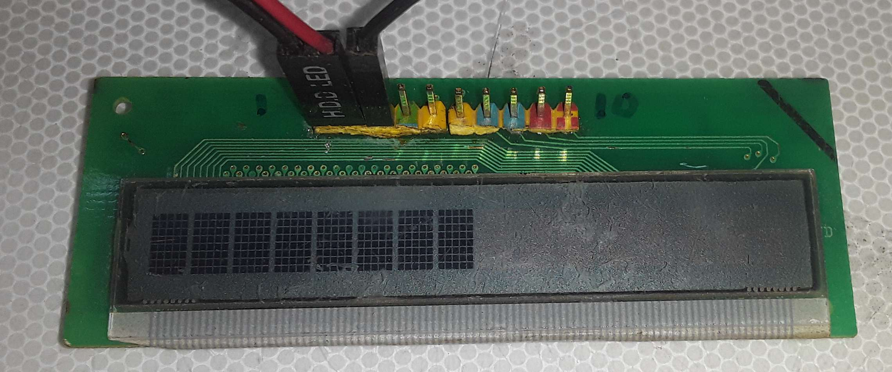
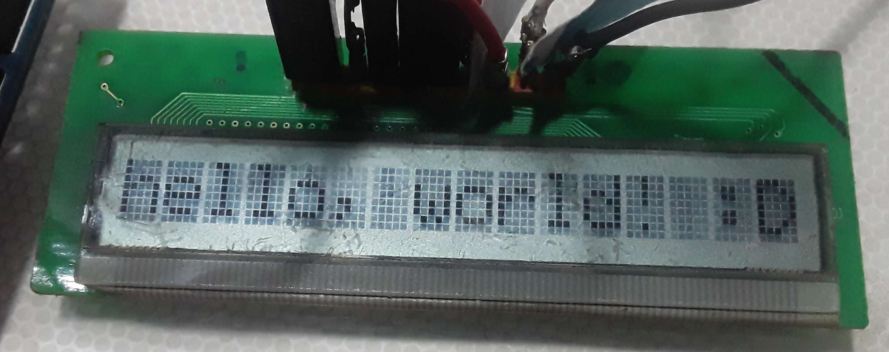
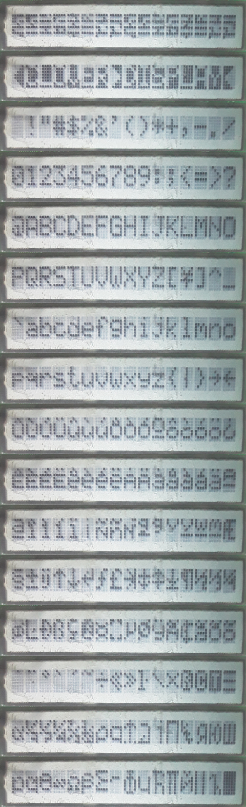
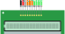

# Display M220 PCB V2.0 (Clover Display LTD)

Display recuperado de un FAX (PFUP1395ZA-UT) se buscara realizar ingeniería inversa para hacerlo funcional.

[Especificaciones Finales](/Baremetal/clover220-RI#especificaciones)

## Montaje Original

De la placa original se identifica una alimentación de 5v al LCD (Pin 1 GND Pin 2 Vcc), 7 van directamente a un microcontrolador y otro va al microcontrolador a través de una resistencia de $27k\Omega$ en conjunto a una resistencia de PullDown $560\Omega$. Asumiendo que la salida del microcontrolador es netamente digital esto seria un divisor de tension

| Pin | Función |
| ---: | -----: |
|  1  | GND     |
|  2  | VCC     |
|  3  | $\mu C$ (Voltage Divider) |
|  4  | $\mu C$ |
|  5  | $\mu C$ |
|  6  | $\mu C$ |
|  7  | $\mu C$ |
|  8  | $\mu C$ |
|  9  | $\mu C$ |
|  10 | $\mu C$ |

se alimenta el display conjunto al pin 3 en pulldown, lo que resulta en



Esto indica que es una pantalla de 16 caracteres de 5x8, se asume que es una pantalla compatible con HD44780. En base a esto se asume un Pinout genérico

| Pin | Función | 
| ---: | -----: |
|  1  | GND     |
|  2  | VCC     |
|  3  | V0 |
|  4  | RS |
|  5  | R/W |
|  6  | E |
|  7  | D4 |
|  8  | D5 |
|  9  | D6 |
|  10 | D7 |

## Test LiquidCrystal.h

Haciendo uso de la librería LiquidCrystal.h y la IDE de Arduino se configuro el display a 8 columnas y 2 filas después de varias pruebas (16x1 solo mostraba la mitad del display), por la disposición del display

```c
#include <LiquidCrystal.h>

const int rs = 12, en = 11, d4 = 5, d5 = 4, d6 = 3, d7 = 2;
LiquidCrystal lcd(rs, en, d4, d5, d6, d7);

void setup() {
  lcd.begin(8, 2);
  lcd.print("hello, w");
  lcd.setCursor(0, 1);
  lcd.print("orld! :D");
}

...
```



## Version de ROM

Los controladores HCD44780U cuentan con una version de ROM para fuentes japonesas, fuentes europeas y custom. En base al datasheet se imprime cada uno de los caracteres con el siguiente código

```c
#include <LiquidCrystal.h>

const int rs = 12, en = 11, d4 = 5, d5 = 4, d6 = 3, d7 = 2;
LiquidCrystal lcd(rs, en, d4, d5, d6, d7);

const int nextButtonPin = 8;  // Pin para ir a la página SIGUIENTE
const int prevButtonPin = 9;  // Pin para ir a la página ANTERIOR

int currentPage = 0;

int lastNextButtonState = HIGH;
int lastPrevButtonState = HIGH;

void setup() {
  lcd.begin(8, 2);

  pinMode(nextButtonPin, INPUT_PULLUP);
  pinMode(prevButtonPin, INPUT_PULLUP);

  displayCurrentPage(); // Primera Pagina
}

void loop() {
  int currentNextButtonState = digitalRead(nextButtonPin);
  int currentPrevButtonState = digitalRead(prevButtonPin);

  if (currentNextButtonState == LOW && lastNextButtonState == HIGH) {
    currentPage++;

    if (currentPage > 15) {
      currentPage = 0;
    }

    displayCurrentPage();
    delay(250); // Retardo para debounce.
  }

  if (currentPrevButtonState == LOW && lastPrevButtonState == HIGH) {
    currentPage--;

    if (currentPage < 0) {
      currentPage = 15;
    }

    displayCurrentPage();
    delay(250); // Retardo para debounce.
  }

  lastNextButtonState = currentNextButtonState;
  lastPrevButtonState = currentPrevButtonState;
}

void displayCurrentPage() {
  lcd.clear();

  int startCharacterCode = currentPage * 16;

  lcd.setCursor(0, 0);
  for (int i = 0; i < 8; i++) {
    lcd.write(startCharacterCode + i);
  }

  lcd.setCursor(0, 1);
  for (int i = 0; i < 8; i++) {
    lcd.write(startCharacterCode + 8 + i);
  }
}

```

Resultando en



Siendo los primeros 16 caracteres un espacio en memoria personalizable, a partir del carácter 17 son los caracteres en memoria ROM, se aprecia un charset custom

## Especificaciones

| | |
| --: | :-- |
| Pines  | 10    |
| Alimentación | +5v |
| Caracteres | 16 |
| Resolución Carácter | 5x8 |
| Controlador | HD44780UB Compatible (Custom Firmware) |
| Configuración LiquidCrystal.h |
| Filas | 2 |
| Columnas | 8 |

### Pinout



| Pin | Función | 
| ---: | :---- |
|  1  | GND     |
|  2  | VCC     |
|  3  | V0 |
|  4  | RS |
|  5  | R/W |
|  6  | E |
|  7  | D4 |
|  8  | D5 |
|  9  | D6 |
|  10 | D7 |

## Referencias

[Datasheet - HD44780U](https://cdn.sparkfun.com/assets/9/5/f/7/b/HD44780.pdf)

[LCD module data](http://www.projects.scorchingbay.nz/dokuwiki/electronic/lcd/pfup1188ya)

::: tip
En el proyecto anterior comprueba por otro autor las características del display en su version v1.0, el cual posee el firmware japones y caracteres de 5x7.
:::

[Pico Pico - Embedded Programming with Rust](https://pico.implrust.com/lcd-display/supported-characters.html)