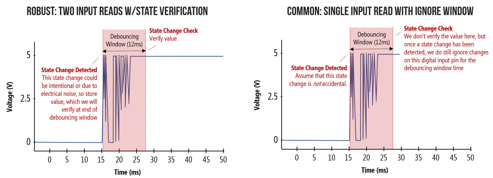

# Debouncing (anti-rebote)

Al presionar un botón se esperaria que la reacción fuera inmediata, en la practica no es asi, al presionar un botón, al ser un dispositivo mecánico esta sujeto a momento y elasticidad, lo que causa oscilaciones rápidas (rebote) en el contacto al abrir o cerrar el circuito. Esto se puede solucionar con software o con hardware.



Para una demostración mas rigurosa [Lesson 3:Debouncing](https://makeabilitylab.github.io/physcomp/arduino/debouncing.html)

Una de las soluciones por software, es detectar un cambio de estado, esperar un intervalo de tiempo para poder aceptar otro cambio, se establece un intervalo de espera arbitrario de `16ms`.

## Interrupciones

Una manera de hacer esto es con Interrupciones. En el caso del Atmega328p cuenta con 3 Temporizadores/Contadores (Timer/Counters) dos de 8 bits y uno de 16 bits, estas son unidades independientes al CPU que permiten hacer operaciones temporales, como contar hasta cierto numero y generar una interrupción.

Lo primero es importar la librería `#include <avr/interrupt.h>` para manejar las interrupciones.

Se utilizara el Timer/Counter0, al ser de 8bits puede contar hasta `255` antes de mandar una interrupción por desbordamiento (overflow) (`>255`) o menos con una interrupción por comparación. Por defecto el contador incrementa su valor por cada ciclo de reloj, al operar el microcontrolador a `16Mhz` significa una interrupción cada $16\mu s$, lo que es demasiado rápido. Para evitar esto cada Timer/Counter posee un prescaler divide el valor del contador en valores de 8, 64, 256, 1024. Para manejar el prescaler se usa el registro `TCCR0B`

**TCCR0B - Timer/Counter Control Register B**

| bit | 2 | 1 | 0 |
| ---: | ---: | ---: | ---: |
| flag | CS02 | CS01 | CS00 |

| CS02 | CS01 | CS00 | Prescaler |
| ---: | ---: | ---: | ---: |
| 0 | 0 | 0 | Detenido |
| 0 | 0 | 1 | Sin escala |
| 0 | 1 | 0 | 8 |
| 0 | 1 | 1 | 64 |
| 1 | 0 | 0 | 256 |
| 1 | 0 | 1 | 1024 |
| 1 | 1 | 0 | Reloj Externo ↑ |
| 1 | 1 | 1 | Reloj Externo ↓ |

Se establece el prescaler en 1024 para activar el contador. Y para desactivarlo simplemente se limpia el registro (establecer a 0)

```c
TCCR0B = (1 << CS02) | (1 << CS00);
```

Esto permite formular la siguiente ecuación

$$
\frac{Freq CPU}{Prescaler}\cdot tiempo = ticks
$$

Donde el numero de $ticks$ es el numero tope que alcanzara el contador en registro de 8bits `TCNT0` (el cual tiene un valor máximo de 255) el $tiempo$ deseado son 16ms, y en el peor de los casos la frecuencia es la maxima en este caso `16Mhz`.

$$

ticks = 250

$$

Lo siguiente es establecer el tope que alcanzara el contador con el registro `OCR0A` (Output Compare Register A) el cual se compara con el registro `TCNT0`, de ser iguales genera una interrupción por comparación.

```c
OCR0A = 250;
```

Cuando el contador llegue al valor de `OCR0A` (se dispara la interrupción) el contador debe volver a cero, para esto se establece el modo CTC (Clear Timer on Compare) con el registro `TCCR0A` tal y como lo muestra el datasheet del atmega328p para los modos de operación del Timer/Counter0, estableciendo el flag `WGM01` a `1` y el resto a `0`.

```c
TCCR0A = (1 << WGM01);
```

El Timer/Counter0 puede desencadenar 3 interrupciones, enmascaradas por el registro `TIMSK0`, dos por comparaciones A y B, y una por desbordamiento, en este caso interesa la interrupción por comparación A

**TIMSK0 – Timer/Counter Interrupt Mask Register**

| bit | 2 | 1 | 0 |
| ---: | ---: | ---: | ---: |
| flag | OCIE0B | OCIE0A | TOIE0 |

* **`OCIE0B`** : Comparador B
* **`OCIE0A`** : Comparador A
* **`TOIE0`** : Desbordamiento

Establecido la interrupción, falta establecer que hacer frente a dicha interrupción, para eso se usa *Interruption Service Routine* con la dirección del vector de interrupción en este caso (ATmega328p) `TIMER0 COMPA` que resulta para `avr-lib` en:

```c
ISR(TIMER0_COMPA_vect) {
    ...
}
```

Con las interrupciones se busca que se presione el botón y este quede inhabilitado a detectar cambios pero sin usar un delay (bloqueando temporalmente el micro) por lo que se plantea la siguiente lógica.

```c
volatile uint8_t button_enable = 1;
uint8_t button_state = 0;

ISR(TIMER0_COMPA_vect);

int main(void)
{
    DDRD &= ~(1 << DDD7); // Swh (Pin 7) [entrada]

    DDRB |= (1 << DDB4); // Tgl (Pin 12) [salida]

    // set CTC mode to use OCR0A as TOP
    TCCR0A = (1 << WGM01);

    // CTC TOP
    OCR0A = 250;

    // Detener prescaler
    TCCR0B = 0;

    // Interrupción Comparador A
    TIMSK0 = (1 << OCIE0A);

    sei();

    button_enable = 1;

    uint8_t button_state = PIND & (1 << PIND7);

    while (1)
    {
        // Debounce sin delay
        if ((PIND & (1 << PIND7)) &&              // Estado Actual del botón
            button_enable &&                      // Botón habilitado
            (PIND & (1 << PIND7) != button_state) // Cambio del estado del botón
        )
        {
            button_enable = 0;

            PORTB = PORTB ^ (1 << PORTB4);

            //  Prescaler para timer0 [1024]
            TCCR0B = (1 << CS02) | (1 << CS00);
        }

        button_state = PIND & (1 << PIND7);
    }

    return 0;
}

ISR(TIMER0_COMPA_vect)
{
    button_enable = 1;
    button_state = PIND & (1 << PIND7);

    // Detener prescaler
    TCCR0B = 0;
}
```