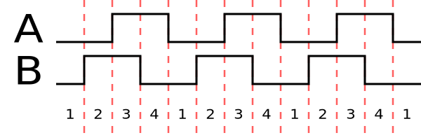
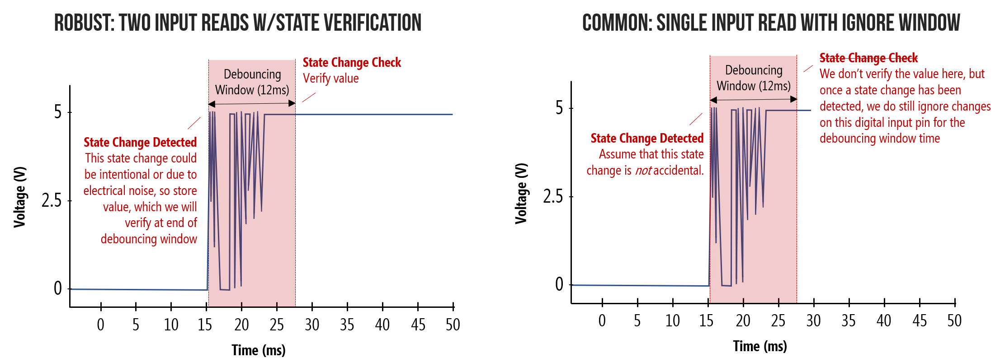

# Encoder Rotatorio Relativo (Incremental Encoder)

Un encoder rotatorio relativo o encoder incremental es dispositivo electromecánico que mediante dos salidas indica la dirección de rotación, estos no indican la posición absoluta.

Este proyecto consistirá en:

1. Indicar la dirección de rotación proveída por el encoder
2. Controlar el brillo de un LED mediante el encoder
3. Detectar una vuelta completa del encoder (estableciendo la posición con un botón)
4. Crear una librería que maneje los tres casos anteriores

Para este proyecto se utilizara un encoder genérico con botón. Leds Rojos 3mm y resistencias de 220 Ohm.

## Pinout encoder


| Pin | Función |
| --- | :-----: |
|  A  | Switch  |
|  B  | Switch  |
|  1  | Señal A |
|  2  | Señal B |
|  3  | Vcc     |

> [!NOTE]
> Este pinout es arbitrario y puede variar según el datasheet del encoder



Al rotar el encoder genera un codigo gray, según la dirección de rotación.

* **Sentido horario**

    (AB) 00 01 11 10

* **Sentido antihorario**

    (AB) 00 10 11 01

## C (Dirección)

El primer acercamiento se busca detectar la dirección de giro y leer el botón con debouncing.

### Puertos

Establecemos la dirección de los puertos con el registro `DDRx`. 3 puertos como entrada (para el switch y señales A y B del encoder) y tres como salida (para los LEDs indicadores de dirección, botón presionado y error)

```c
DDRD &= ~(1 << DDD5); // A (Pin 5)
DDRD &= ~(1 << DDD6); // B (Pin 6)
DDRD &= ~(1 << DDD7); // Swh (Pin 7)
DDRB = DDRB | (1 << DDB5); // Dir (Pin 13)
DDRB = DDRB | (1 << DDB4); // Tgl (Pin 12)
DDRB = DDRB | (1 << DDB3); // Err (Pin 11)
```

Para leer el valor de los puertos de entrada utilizamos el registro `PINx` y para establecer el valor en los pines de salida utilizamos el registro `PORTx`

La señales A y B forman un codigo gray de 2 bits.

**sentido horario**
| base | 1 | 2 | 3 | 4 |
| ---: | ---: | ---: | ---: | ---: |
| binario | 00 | 01 | 11 | 10 |
| decimal |  0 |  1 |  3 |  2 |

**sentido antihorario**
| base | 1 | 2 | 3 | 4 |
| ---: | ---: | ---: | ---: | ---: |
| binario | 00 | 10 | 11 | 01 |
| decimal |  0 |  2 |  3 |  3 |

Para detectar el cambio se crea una variable global `step` para la posición anterior y `step_new` para la actual. Ej. si la posición `step` anterior es `11` y la nueva `step_new` `10` el encoder va en sentido horario, si `step_new` es `01` va en sentido antihorario y si `step_new` es `00` se produjo un error de lectura.

```c
...
uint8_t step = 0;
while (1) {
    uint8_t step_new = ((PIND & (1 << PIND5)) ? 2 : 0) |
                       ((PIND & (1 << PIND6)) ? 1 : 0);
...
```

En este sentido para indicar la dirección si va en sentido horario establecemos al pin `B5` (13 Arduino UNO) un `1` asertivo y de lo contrario `0` asertivo. De darse un error alternamos el pin `B3` (11 Arduino UNO).

```c
switch (step) {
    case 0:
        if (step_new == 1)
            PORTB = PORTB | (1 << PORTB5);
        else if (step_new == 2)
            PORTB = PORTB & ~(1 << PORTB5);
        else
            PORTB = PORTB ^ (1 << PORTB3);
        break;
    case 1:
        if (step_new == 3)
            PORTB = PORTB | (1 << PORTB5);
        else if (step_new == 0)
            PORTB = PORTB & ~(1 << PORTB5);
        else
            PORTB = PORTB ^ (1 << PORTB3);
        break;
    case 2:
        if (step_new == 0)
            PORTB = PORTB | (1 << PORTB5);
        else if (step_new == 3)
            PORTB = PORTB & ~(1 << PORTB5);
        else
            PORTB = PORTB ^ (1 << PORTB3);
        break;
    case 3:
        if (step_new == 2)
            PORTB = PORTB | (1 << PORTB5);
        else if (step_new == 1)
            PORTB = PORTB & ~(1 << PORTB5);
        else
            PORTB = PORTB ^ (1 << PORTB3);
        break;
    default:
        break;
}
step = step_new;
```

>[!NOTE]
> Para propósitos prácticos el estado de error se puede omitir


>[!NOTE]
> `x` se refiere al puerto (A, B o C) y `n` a la posición en especifico

>[!NOTE]
> Al referirse a una dirección especifica se utiliza por ejemplo `PINxn` para `PINx`, `DDxn` para `DDRx`, `PORTxn` para `PORTx`. Estos se refieren a la misma dirección (es decir pueden ser usados para cualquier registro sin problemas), se usan de esta manera para facilitar la lectura del codigo. Ej. la librería io para Atmega328p `iom328p.h`
> ```c
>#define PINB0 0
>#define DDB0 0
>#define PORTB0 0
>```

### Debouncing (anti-rebote)

Al presionar un botón esperaríamos que la reacción fuera inmediata, en la practica no es asi, al presionar un botón, al ser un dispositivo mecánico esta sujeto a momento y elasticidad, lo que causa oscilaciones rápidas (rebote) en el contacto al abrir o cerrar el circuito. Esto se puede solucionar con software o con hardware.



Para una demostración mas rigurosa [Lesson 3:Debouncing](https://makeabilitylab.github.io/physcomp/arduino/debouncing.html)

Una de las soluciones, al detectar un cambio de estado, esperar un intervalo de tiempo para poder aceptar otro cambio, establecermos un intervalo de espera arbitrario de `16ms`.

Una manera de hacer esto es con Interrupciones. En el caso del Atmega328p cuenta con 3 Temporizadores/Contadores (Timer/Counters) dos de 8 bits y uno de 16 bits, estas son unidades independientes al CPU que permiten hacer operaciones temporales, como contar hasta cierto numero y generar una interrupción.

Lo primero es importar la librería `#include <avr/interrupt.h>` para manejar las interrupciones.

Utilizaremos el Timer/Counter0, al ser de 8bits puede contar hasta `255` antes de mandar una interrupción por desbordamiento (overflow) (`>255`) o menos con una interrupción por comparación. Por defecto el contador incrementa su valor por cada ciclo de reloj, al operar el microcontrolador a `16Mhz` significa una interrupción cada $16\mu s$, lo que es demasiado rápido. Para evitar esto cada Timer/Counter posee un prescaler divide el valor del cantador en valores de 8, 64, 256, 1024. Para manejar el prescaler se usa el registro `TCCR0B`

**TCCR0B - Timer/Counter Control Register B**

| bit | 2 | 1 | 0 |
| ---: | ---: | ---: | ---: |
| flag | CS02 | CS01 | CS00 |

| CS02 | CS01 | CS00 | Prescaler |
| ---: | ---: | ---: | ---: |
| 0 | 0 | 0 | Detenido |
| 0 | 0 | 1 | Sin escala |
| 0 | 1 | 0 | 8 |
| 0 | 1 | 1 | 64 |
| 1 | 0 | 0 | 256 |
| 1 | 0 | 1 | 1024 |
| 1 | 1 | 0 | Reloj Externo ↑ |
| 1 | 1 | 1 | Reloj Externo ↓ |

establecemos el prescaler en 1024

```c
TCCR0B = (1 << CS02) | (1 << CS00);
```

Esto nos permite formular la siguiente ecuación

$$
\frac{Freq CPU}{Prescaler}\cdot tiempo = ticks
$$

Donde el numero de $ticks$ es el numero tope que alcanzara el contador en registro de 8bits `TCNT0` (el cual tiene un valor máximo de 255) el $tiempo$ deseado son 16ms, y en el peor de los casos la frecuencia es la maxima en este caso `16Mhz`.

$$

ticks = 250

$$

Lo siguiente es establecer el tope que alcanzara el contador con el registro `OCR0A` (Output Compare Register A) el cual se compara con el registro `TCNT0`, de ser iguales genera una interrupción por comparación.

```c
OCR0A = 250;
```

Cuando el contador llegue al valor de `OCR0A` a comparar el contador debe volver a cero, para esto se establece el modo CTC (Clear Timer on Compare) con el registro `TCCR0A` tal y como lo muestra el datasheet del atmega328p para los modos de operación del Timer/Counter0, estableciendo el flag `WGM01` a `1` y el resto a `0`.

```c
TCCR0A = (1 << WGM01);
```

El Timer/Counter0 puede desencadenar 3 interrupciones, enmascaradas por el registro `TIMSK0`, dos por comparaciones A y B, y una por desbordamiento, en nuestro caso nos interesa la interrupción por comparacion A

**TIMSK0 – Timer/Counter Interrupt Mask Register**

| bit | 2 | 1 | 0 |
| ---: | ---: | ---: | ---: |
| flag | OCIE0B | OCIE0A | TOIE0 |

* **`OCIE0B`** : Comparador A
* **`OCIE0A`** : Comparador B
* **`TOIE0`** : Desbordamiento

Establecido la interrupción, falta establecer que hacer frente a dicha interrupción, para eso se usa la sintaxis

```c
ISR(TIMER0_COMPA_vect) {
}
```