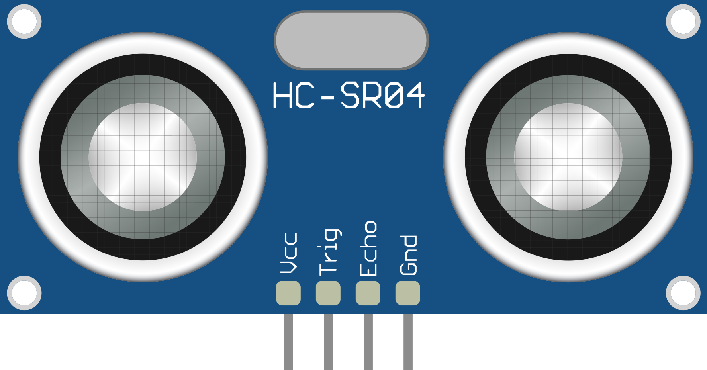

# Modulo HC-SR04

<Badge type="danger" text="incompleto" />

Modulo sensor de distancia de ultra-sonido HC-SR04. Este modulo en particular funciona emitiendo 8 pulsos a 40khz, al recibir un pulso de 10us de entrada (trigger), colocando la salida (echo) en nivel alto, cuando los pulsos llegan al modulo la salida (echo) pasa a nivel bajo. el tiempo que dura la salida (echo) en alto determina el tiempo que tarda el sonido en salir del modulo y volver al mismo. Al ser la velocidad del sonido constante (para una temperatura constantes y un medio homogéneo).

Este proyecto consistirá en:

1. Hacer una librería para el modulo para obtener distancia de forma eficiente y precisa.

<!-- 2. Obtener su salida en comunicación serial. -->

## Pinout



<!-- Gráfica en el tiempo -->

## Parámetros

* Rango de medición: 2cm a 450cm
* Precisión: +- 3mm

Esto nos permite saber la duración minima y maxima del *echo* asi como la precision. Sabiendo la velocidad el sonido $c$ (~346m/s)

$$
\begin{gather}
Echo_{Min}=\frac{2cm}{c}\approx 57.8034\mu s\\
Echo_{Max}=\frac{4.5m}{c}\approx 13.0057ms\\
Echo_{\Delta}=\frac{3mm}{c}\approx 8.6705\mu s
\end{gather}
$$

## Acercamiento por unidad patron por $\Delta$ minima de distancia

Se tiene $Echo_{\Delta}$ como unidad patron ya que lo mas sencillo es hacer delays de la escala de $\mu s$ se redondea hacia abajo a $Echo'_{\Delta}=8\mu s$, y el alcance como 

$$
Units = \frac{Echo_{Max}-Echo_{Min}}{Echo'_{\Delta}} \approx 1625
$$

::: tip
1625 entra dentro de un uint16 para un rango completo, si el rango de medición es de ~70cm puede entrar dentro de un uint8 para simplificar el computo
:::

Con esto se crea un bucle contando en intervalos de 8us ($Echo'_{\Delta}$) contando hasta que termine el echo pero también hace falta contar la cantidad de ciclos dentro del bucle ya que cada instrucción conlleva un tiempo y este tiempo es acumulativo, al usar un reloj a $16Mhz$ cada instrucción dura 62.5ns por lo que la medición debe tener en cuenta la cantidad de ciclos que lleva cada ciclo en adición al delay ($Echo'_{\Delta}$)

$$
\begin{gather}
Inst_{time}=Nro_{Ciclos}/F_{CPU}\\
Echo_{\Delta Fix}=Echo'_{\Delta} - Inst_{time}
\end{gather}
$$

::: warning
Dicha operación es bloqueante y pierde precision si alguna interrupción se ejecuta.
:::

### Conteo de ciclos para corrección del Delay

para obtener la cantidad de ciclos se compila el siguiente código de prueba (para units de 16bits)

```c
#ifndef __AVR_ATmega328P__
#define __AVR_ATmega328P__
#endif

#ifndef F_CPU
#define F_CPU 16000000ULL // 16Mhz
#endif

#include <avr/io.h>
#include <util/delay.h>

// Sensor properties
#define C_SOUND 343.0
#define DISTANCE_MIN 0.02
#define DISTANCE_MAX 4
#define DISTANCE_PRS 3e-3

// Echo Times
#define ECHO_MAX (DISTANCE_MAX / C_SOUND)
#define ECHO_MIN (DISTANCE_MIN / C_SOUND)
// For a microsecond precision
#define ECHO_DEL (DISTANCE_PRS / C_SOUND) // seconds per unit

// Instruction Correction
#define INST_LOOP 7
#define INST_TIME (INST_LOOP / (float)F_CPU)

// Echo Instruction correction
#define ECHO_DEL_US (1e6)*( ECHO_DEL - INST_TIME )

static_assert(ECHO_DEL_US > 0, "Too many Instructions in the loop");

#define UNITS_MAX ((ECHO_MAX - ECHO_MIN) / ECHO_DEL)

int main() {
  // Config Ports
  DDRB |= (1 << DDB0);  // Trig
  DDRB &= ~(1 << DDB1); // Echo

    // Send trigger
    PORTB |= (1 << PORTB0);
    _delay_us(10);
    PORTB &= ~(1 << PORTB0);

    uint16_t units = 0;

    // wait until echo is true
    while (!(PINB & (1 << PINB1)))
        asm("nop");
    while ((PINB & (1 << PINB1)))
    {
        _delay_us(ECHO_DEL_US);
        units++;
        if (units >= UNITS_MAX)
            break;
    }

    // delay before next measurement
    _delay_ms(100);
}
```

se extrae el siguiente segmento del código en ASM

```asm
  90:	19 9b       	sbis	0x03, 1	   ; 3     // Wait for Echo pin to go HIGH
  92:	16 c0       	rjmp	.+44     	;  0xc0 // If not, loop
  94:	8f e2       	ldi	r24, 0x2F	; 47    // Setup for echo timing loop (units counter)
  96:	95 e0       	ldi	r25, 0x05	; 5
  98:	19 9b       	sbis	0x03, 1	   ; 3     // While Echo pin is HIGH
  9a:	06 c0       	rjmp	.+12     	; 0xa8  // If not, exit loop

; Delay for ECHO_DEL_US
  9c:	2c e2       	ldi	r18, 0x2C	; 44 (8.25ms)
  9e:	2a 95       	dec	r18
  a0:	f1 f7       	brne	.-4      	;  0x9e // Delay loop

 a2:  00 00     nop              ; Alignment/padding.

 a4:  01 97     sbiw  r24, 0x01
 a6:  c1 f7     brne  .-16

...

  c0:	00 00       	nop               ; Loop waiting for echo
  c2:	e6 cf       	rjmp	.-52     	;  0x90
```

Contando del bucle del delay la declaración `LDI` y el `NOP` que se ejecutan una sola vez por bucle se tiene un total de 13 ciclos (mas 3 ciclos de configuración)

::: info
Si se toma un units de 8bits (`uint8_t`) el compilador usara la instrucción `SUBI` o `DEC` en vez de `SBIW`. tanto `SUBI` como `DEC` utilizan 1 ciclo por instrucción envés de 2, por lo que el conteo se reduce a 12 ciclos
:::

### Corrección decimal del Delay

Si el delay fuese `float` bastaría con decir que cada *unit* equivale a una unidad patron de distancia (3mm) pero al hacer la conversion de float a int se pierde dicha precision para compensar esto se tiene la siguiente expresión

$$
Units_{Dist} = \lfloor Echo_{\Delta Fix}\rfloor + Inst_{time}
$$

## Acercamiento por unidad patron por tamaño de variable (16bits)

Los sensores HC-SR04 funcionan internamente con un microcontrolador como el STC11F, al usar un modulo genérico se desconoce realmente la precision en tiempo del modulo. Al hacer una aproximación en base a la precision se asume que el microcontrolador y el modulo están en fase, lo cual esta lejos de la realidad. Un acercamiento mas preciso seria establecer un unit de tiempo al máximo de una variable de 16 bits (u 8 bits).

Para esto se obtiene $Echo_{\Delta}$ de la siguiente manera

$$
Echo_{\Delta} = \frac{Echo_{Max}-Echo_{Min}}{2^{16}-1} \approx 177.8588ns
$$

Esto genera un problema ya que esto son < de 3 ciclos en tiempo del procesador (para 16Mhz) comparado con las 13 instrucciones que ya incluye el ciclo, por lo que se podría hacer sin delay se plantea el siguiente código para obtener la cantidad de ciclos

```c
#ifndef __AVR_ATmega328P__
#define __AVR_ATmega328P__
#endif

#ifndef F_CPU
#define F_CPU 16000000ULL // 16Mhz
#endif

#include <avr/io.h>
#include <util/delay.h>

#define UNIT_LIMIT 0xffff // 16bits

int main()
{
    // Config Ports
    DDRB |= (1 << DDB0);  // Trig
    DDRB &= ~(1 << DDB1); // Echo

    // Send trigger
    PORTB |= (1 << PORTB0);
    _delay_us(10);
    PORTB &= ~(1 << PORTB0);

    uint16_t units = 0;

    // wait until echo is true
    while (!(PINB & (1 << PINB1)))
        asm("nop");
    while ((PINB & (1 << PINB1)) && units < UNIT_LIMIT) {
        units++;
    }

}
```

```asm
...
; --- Espera a que Echo sea alto ---
; while (!(PINB & (1 << PINB1))) asm("nop");
  90:   19 9b           sbis    0x03, 1 ; 3   ; salta si PINB1 es alto
  92:   09 c0           rjmp    .+18        ;  0xa6 ; si no, sigue esperando (bucle espera echo alto)

; --- Inicialización de variable units ---
  94:   80 e0           ldi r24, 0x00   ; 0   ; units (parte baja)
  96:   90 e0           ldi r25, 0x00   ; 0   ; units (parte alta)

; --- Bucle principal: while ((PINB & (1 << PINB1)) && units < UNIT_LIMIT) ---
  98:   19 9b           sbis    0x03, 1 ; 3   ; salta si PINB1 es alto (echo sigue activo)
  9a:   07 c0           rjmp    .+14        ;  0xaa ; si no, termina bucle

; --- Comparativa: units < UNIT_LIMIT ---
  9c:   8f 3f           cpi r24, 0xFF   ; compara parte baja de units con 0xFF
  9e:   98 07           cpc r25, r24    ; compara parte alta de units con parte baja (en este contexto, compara con 0xFF00)
  a0:   21 f0           breq    .+8         ;  0xaa ; si units == 0xFFFF, termina bucle

; --- Incremento de units ---
  a2:   01 96           adiw    r24, 0x01   ; units++
  a4:   f9 cf           rjmp    .-14        ;  0x98 ; repite bucle
...
```

Resultando en 9 ciclo por ciclo y 4 ciclos iniciales. Al conocer el tiempo por cada ciclo y la velocidad obtenemos la distancia por cada ciclo

$$
\begin{gather}
Dist_{init} = Ciclos_{init}* C_{sonido}/f \approx 0.08575mm\\
Dist_{\Delta} = Ciclos_{loop}* C_{sonido}/f \approx 0.1929mm
\end{gather}
$$

Al usar acumulador de 16 bits se tiene un rango genérico de ~0.08575mm a 12.64424m con un $\Delta\approx0.1929mm$.

Esto permite crear una librería genérica sin sacrificar rendimiento si tamaño de la librería

## Calculo de la distancia

Una vez obtenido el tiempo del echo que es el tiempo que tarda la onda en salir del modulo y volver se realiza el siguiente calculo

$$
Distancia = \frac{Units \cdot Ciclos_{loop} + Ciclos_{init}}{2}
$$

## Acercamiento por interrupción (328p)

las interrupciones permiten realizar cualquier otra tarea mientras se obtiene la medición, para esto se utiliza el Timer/Counter1 al ser un 16bits nos permite tener una precision mayor a los demás timer de 8 bits. asi como la interrupción propia del timer "capture event"