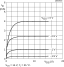
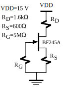
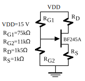
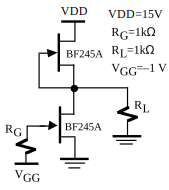
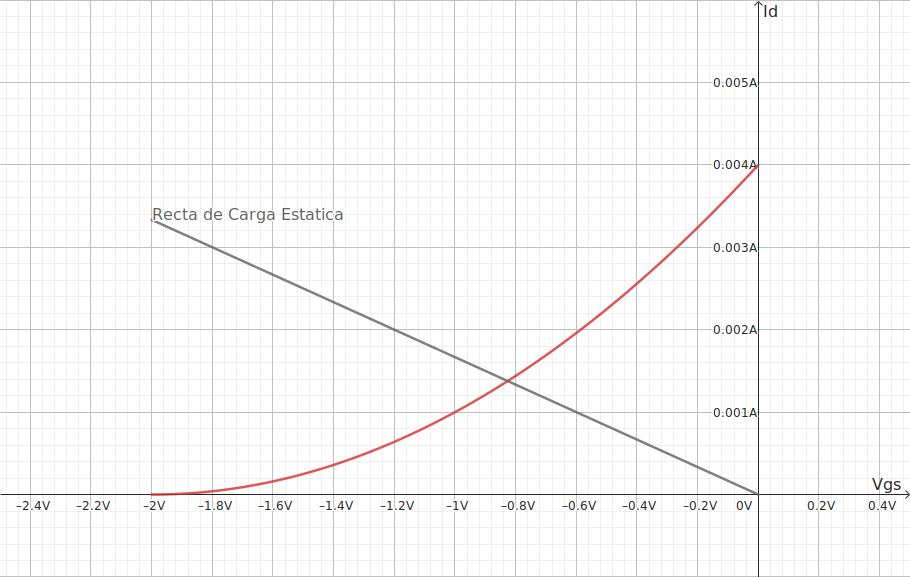
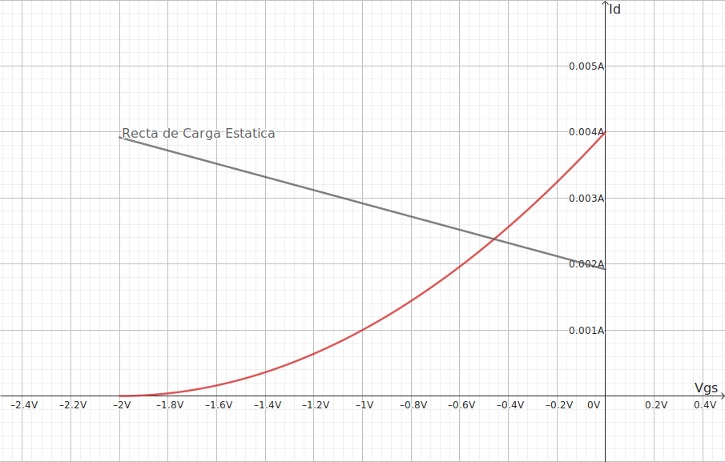
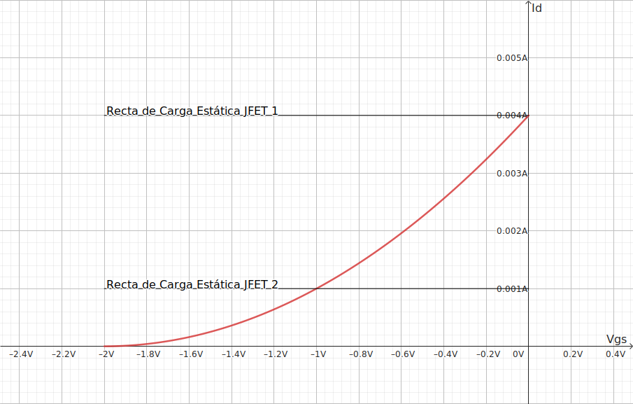

## Ejercicios

### Electronica Básica para Ingenieros P 1.9

El BF245A es un transistor JFET de canal N para aplicaciones de amplificación en VHF/UHF. Las características DC de este JFET se muestran en la figura P1.9a y P1.9b. Con esta información determinar el punto de trabajo de los transistores de las figuras P1.9.1, P1.9.2 y P1.9.3.

*
Fig P1.9a - Características de transferencia para el BF245A
*

*
Fig P1.9a - Características de salida para el BF245A
*

*
Fig P1.9.1
*

*
Fig P1.9.2
*

*
Fig P1.9.3
*

:::details Respuesta

Con los datos de la Fig. P1.9a conocemos que $V_p=-2V$ y $I_{DSS}=4mA$

#### P1-1

Para el primer ejercicio analizamos la malla de entrada

$$

0-R_G5\cdot I_G-V_{GS}-R_S\cdot I_S-0=0

$$

Tomamos $I_G$ como 0 ya que la impedancia entre *Gate* y *Source* es muy alta, a su ves $I_S = I_D$ por lo que queda:

$$
\begin{gather}
V_{GS}=-600\cdot I_D\tag{1}
\end{gather}
$$

Que describe la recta de carga que pasa por el origen. Luego tenemos la curva que define $I_D$ de saturación en función de $V_{GS}$

$$
\begin{gather}
I_D=I_{DSS}\cdot\left(1-\frac{V_{GS}}{V_p}\right)^2\tag{a}\\
I_D=1m\cdot\left(2+V_{GS}\right)^2
\end{gather}
$$

Igualando la Ec. (1) y (a) obtenemos lo puntos de intersección de la recta

$$
\begin{gather}
I_{D_{1}}\approx1.3773mA\\
I_{D_{2}}\approx8.0671mA
\end{gather}
$$

Al ser $I_{D_{2}}$ mayor al $I_{DSS}$ se descarta, lo que nos deja con la siguiente intersección.

Donde el punto de trabajo es $V_{GS}\approx-0.8264V;I_D\approx1.3773mA$, con estos datos podemos calcular $V_{DS}$, tomando la maya de salida:

$$
\begin{gather}
V_{DD}-R_D\cdot I_D-V_{DS}-R_S\cdot I_D-0=0\\
V_{DS}\approx11.9698V
\end{gather}
$$

Para comprobar que el transistor esta en la region de saturación se comprueba la condición.

$$
\begin{gather}
V_{DS}\geq V_{GS}-V_p\tag{b}\\
11.9698 \geq 1.1735
\end{gather}
$$

#### P1-2

Para este caso $R_{G_1}$ y $R_{G_2}$ forman un divisor de tension, al ser la corriente de *Gate* despreciable, solo necesitamos la tension del *Gate* $V_G$

$$
\begin{gather}
V_G=\frac{R_{G_2}\cdot(V_{DD}-0)}{R_{G_1}+R_{G_2}}\\
V_G=\frac{R_{G_2}\cdot V_{DD}}{R_{G_1}+R_{G_2}}\\
V_G=\frac{165}{86}\\
V_G\approx1.9186V
\end{gather}
$$

Por lo que se puede modelar de la siguiente manera

ahora se toma la malla de entrada, para obtener la ecuación de la recta de carga.

$$
\begin{gather}
0+V_G-V_{GS}-R_S\cdot I_D-0=0\\
V_{GS}=V_G-R_S\cdot I_D\\
V_{GS}\approx1.9186-1k\cdot I_D\tag{2}
\end{gather}
$$

se toma la curva de saturación del ejercicio anterior (por ser el mismo transistor). Igualando la Ec. (2) y (a) obtenemos lo puntos de intersección de la recta.

> [!NOTE]
> A diferencia del ejercicio anterior se despejo $V_{GS}$

$$
\begin{gather}
V_{GS_1}=-4.5417V\\
V_{GS_2}=-0.4582V
\end{gather}
$$

Al ser $V_{GS_1}$ mayor a $V_{GS_{(off)}}$ ($V_{p}$) se descarta.

Donde el punto de trabajo es $V_{GS}\approx-0.4582V;I_D\approx2.3768mA$, con estos datos podemos calcular $V_{DS}$, tomando la maya de salida:

$$
\begin{gather}
V_{DD}-R_D\cdot I_D-V_{DS}-R_S\cdot I_D-0=0\\
V_{DS}\approx9.0577V
\end{gather}
$$

Para comprobar que el transistor esta en la region de saturación se comprueba la condición de la Eq. (b).

$$
\begin{gather}
V_{DS}\geq V_{GS}-V_p\tag{b}\\
9.0577 \geq 1.5417
\end{gather}
$$

#### P1-3

Se numera al JFET superior como (1) y al inferior como (2), resolvemos la malla de entrada del JFET (2).

$$
0 + V_{GG} - V_{GS_2} - 0\\
V_{GS_2} = V_{GG}\\
V_{GS_2} = -1V\\
$$

Junto a la Ec. (a), asumiendo de que esta en saturación para obtener $I_{DSS_2}$

$$
\begin{gather}
I_{D_2} = 1mA
\end{gather}
$$

por otro lado $V_{GS_1}=0$, por lo que a términos de la Ec. (a)

$$
\begin{gather}
I_{D_1} = 4mA
\end{gather}
$$

Se analiza el nodo entre JFETs y la carga $R_L$, lo intentificaremos como nodo 1

$$
\begin{gather}
I_{D_1} - I_{D_2} = I_L\\
I_L = 3mA
\end{gather}
$$

al conocer la corriente $I_L$ se puede conocer la tension entre los terminales de la resistencia $R_L$ a su vez del nodo 1 respecta a tierra.

$$
V_{R_L}=I_L\cdot R_L\\
V_{R_L}=3V
$$

la resistencia $R_L$ esta en paralelo con los terminales *Drain* y *Source* del JFET 2, por lo que también sabemos que la tension $V_{DS_2}=3V$. Al completar la malla o al calcular la diferencia de potencial para con el JFET 1, obtenemos que $V_{DS_1}=12V$

Por ultimo se comprueba las ecuaciones la condicion de la Ec. (b)

$$
\begin{gather}
V_{DS_1} \geq 0 - (-2)\\
12 \geq 2\\
V_{DS_2} \geq - 1 - (-2)\\
3 \geq 1\\
\end{gather}
$$
:::

<!-- ## Parcial -->