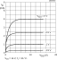
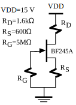
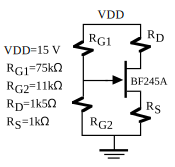
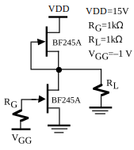
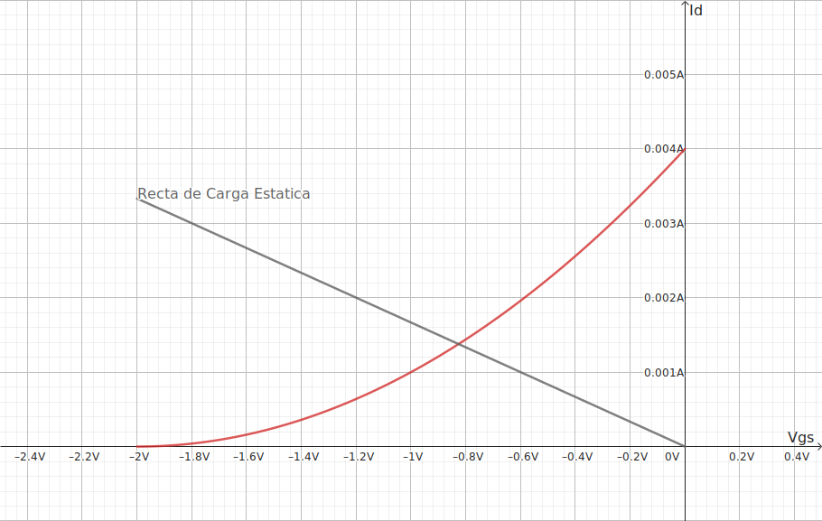
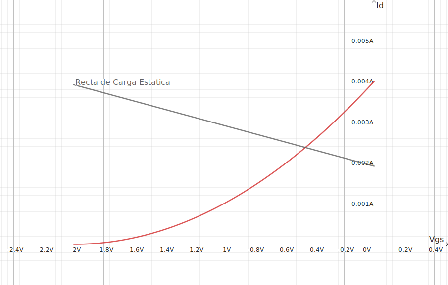
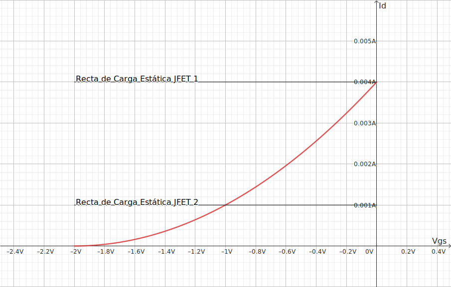
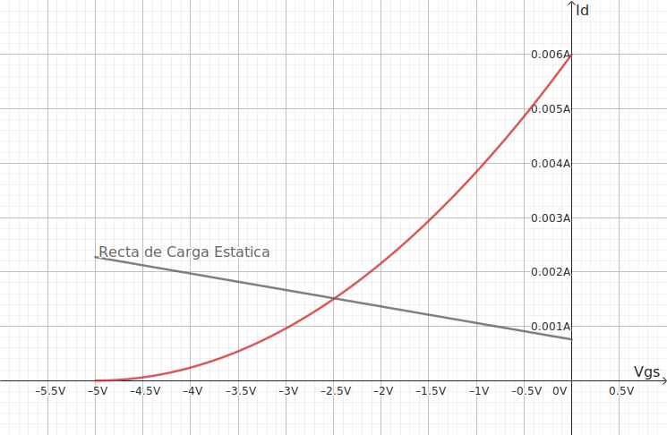

## Ejercicios

> [!NOTE]
> Los ejercicios a continuación son del libro *Electronica Básica para Ingenieros* y *Electronica Básica para Ingenieros problemas resueltos*, con la aclaración de que uno no es el solucionario del otro

### Electronica Básica para Ingenieros P 1.9

El BF245A es un transistor JFET de canal N para aplicaciones de amplificación en VHF/UHF. Las características DC de este JFET se muestran en la figura P1.9a y P1.9b. Con esta información determinar el punto de trabajo de los transistores de las figuras P1.9.1, P1.9.2 y P1.9.3.

*
Fig P1.9a - Características de transferencia para el BF245A
*

*
Fig P1.9a - Características de salida para el BF245A
*

*
Fig P1.9.1
*

*
Fig P1.9.2
*

*
Fig P1.9.3
*

:::details Respuesta

Con los datos de la Fig. P1.9a se sabe que $V_p=-2V$ y $I_{DSS}=4mA$

#### P1-1

Para el primer ejercicio se analiza la malla de entrada

$$

0-R_G\cdot I_G-V_{GS}-R_S\cdot I_S-0=0

$$

Se toma $I_G$ como 0 ya que la impedancia entre *Gate* y *Source* es muy alta, a su ves $I_S = I_D$ por lo que queda:

$$
\begin{gather}
V_{GS}=-600\cdot I_D\tag{1}
\end{gather}
$$

Que describe la recta de carga que pasa por el origen. Luego se tiene la curva que define $I_D$ de saturación en función de $V_{GS}$

$$
\begin{gather}
I_D=I_{DSS}\cdot\left(1-\frac{V_{GS}}{V_p}\right)^2\tag{a}\\
I_D=1m\cdot\left(2+V_{GS}\right)^2
\end{gather}
$$

Igualando la Ec. (1) y (a) se obtienen los puntos de intersección de la recta

$$
\begin{gather}
I_{D_{1}}\approx1.3773mA\\
I_{D_{2}}\approx8.0671mA
\end{gather}
$$

Al ser $I_{D_{2}}$ mayor al $I_{DSS}$ se descarta, lo que deja con la siguiente intersección.

Donde el punto de trabajo es $V_{GS}\approx-0.8264v;I_D\approx1.3773mA$, con estos datos se puede calcular $V_{DS}$, tomando la maya de salida:

$$
\begin{gather}
V_{DD}-R_D\cdot I_D-V_{DS}-R_S\cdot I_D-0=0\\
V_{DS}\approx11.9698v
\end{gather}
$$

Para comprobar que el transistor esta en la region de saturación se comprueba la condición.

$$
\begin{gather}
V_{DS}\geq V_{GS}-V_p\tag{b}\\
11.9698 \geq 1.1735
\end{gather}
$$

#### P1-2

Para este caso $R_{G_1}$ y $R_{G_2}$ forman un divisor de tension, al ser la corriente de *Gate* despreciable, solo se necesita la tension del *Gate* $V_G$

$$
\begin{gather}
V_G=\frac{R_{G_2}\cdot(V_{DD}-0)}{R_{G_1}+R_{G_2}}\\
V_G=\frac{R_{G_2}\cdot V_{DD}}{R_{G_1}+R_{G_2}}\\
V_G=\frac{165}{86}\\
V_G\approx1.9186v
\end{gather}
$$

Por lo que se puede modelar de la siguiente manera

ahora se toma la malla de entrada, para obtener la ecuación de la recta de carga.

$$
\begin{gather}
0+V_G-V_{GS}-R_S\cdot I_D-0=0\\
V_{GS}=V_G-R_S\cdot I_D\\
V_{GS}\approx1.9186-1k\cdot I_D\tag{2}
\end{gather}
$$

Se toma la curva de saturación del ejercicio anterior (por ser el mismo transistor). Igualando la Ec. (2) y (a) se obtienen los puntos de intersección de la recta.

> [!NOTE]
> A diferencia del ejercicio anterior se despejo $V_{GS}$

$$
\begin{gather}
V_{GS_1}=-4.5417v\\
V_{GS_2}=-0.4582v
\end{gather}
$$

Al ser $V_{GS_1}$ mayor a $V_{GS_{(off)}}$ ($V_{p}$) se descarta.

Donde el punto de trabajo es $V_{GS}\approx-0.4582V;I_D\approx2.3768mA$, con estos datos se calcula $V_{DS}$, tomando la maya de salida:

$$
\begin{gather}
V_{DD}-R_D\cdot I_D-V_{DS}-R_S\cdot I_D-0=0\\
V_{DS}\approx9.0577v
\end{gather}
$$

Para comprobar que el transistor esta en la region de saturación se comprueba la condición de la Eq. (b).

$$
\begin{gather}
V_{DS}\geq V_{GS}-V_p\tag{b}\\
9.0577 \geq 1.5417
\end{gather}
$$

#### P1-3

Se numera al JFET superior como (1) y al inferior como (2), se resuelve la malla de entrada del JFET (2).

$$
0 + V_{GG} - V_{GS_2} - 0\\
V_{GS_2} = V_{GG}\\
V_{GS_2} = -1v\\
$$

Junto a la Ec. (a), asumiendo de que esta en saturación para obtener $I_{DSS_2}$

$$
\begin{gather}
I_{D_2} = 1mA
\end{gather}
$$

por otro lado $V_{GS_1}=0$, por lo que a términos de la Ec. (a)

$$
\begin{gather}
I_{D_1} = 4mA
\end{gather}
$$

Se analiza el nodo entre JFETs y la carga $R_L$, se identifica arbitrariamente como nodo 1

$$
\begin{gather}
I_{D_1} - I_{D_2} = I_L\\
I_L = 3mA
\end{gather}
$$

al conocer la corriente $I_L$ se puede conocer la tension entre los terminales de la resistencia $R_L$ a su vez del nodo 1 respecta a tierra.

$$
V_{R_L}=I_L\cdot R_L\\
V_{R_L}=3v
$$

la resistencia $R_L$ esta en paralelo con los terminales *Drain* y *Source* del JFET 2, en consecuencia se tiene la tension $V_{DS_2}=3V$. Al completar la malla o al calcular la diferencia de potencial para con el JFET 1, resulta que $V_{DS_1}=12V$

Por ultimo se comprueba las ecuaciones la condición de la Ec. (b)

$$
\begin{gather}
V_{DS_1} \geq 0 - (-2)\\
12 \geq 2\\
V_{DS_2} \geq - 1 - (-2)\\
3 \geq 1\\
\end{gather}
$$
:::

### Electronica Básica para Ingenieros - Problemas resueltos P 3

Calcular el punto de trabajo de transistores $Q_1$, $Q_2$ de la figura

$V_{CC}=15v$, $R_1=10k\Omega$, $R_2=50k\Omega$, $R_3=400k\Omega$, $R_4=1k\Omega$, $R_5=3k3\Omega$, $V_{BE}=0.7$, $h_{fe}=100$, $I_{DSS}=6mA$, $V_P=-5V$

:::details Respuesta

La tension en el *gate* del JFET viene dado por el divisor de tension formado por $R_1$ y $R_2$. La corriente de *gate* $I_G\approx 0$ por lo que se calcula solo la tension en el punto $V_G$. Ademas $I_S=I_D$

$$
\begin{gather}
V_G = \frac{R_1\cdot V_{cc}}{R_1+R_2}\\
V_G = 2.5v
\end{gather}
$$

Se realiza la malla de entrada del JFET, para obtener la recta de carga estática

$$
\begin{gather}
V_G - V_{GS} - R_5\cdot I_D - 0 = 0\\
V_{GS} = 2.5 - 3.3k\cdot I_D
\end{gather}
$$

Se toma la ecuación de curva de saturación.

$$
\begin{gather}
I_D=I_{DSS}\cdot\left(1-\frac{V_{GS}}{V_p}\right)^2\\
I_D=240mA\cdot(5+V_{GS})^2
\end{gather}
$$

Igualando ambas ecuaciones obtenemos

$$
\begin{gather}
I_{D_1}\approx1.5121mA; V_{GS_1}\approx-2.48994V\\
I_{D_2}\approx3.41597mA; V_{GS_2}\approx-8.77269V
\end{gather}
$$

$V_{GS_2}<V_P$ por lo que $I_{D_2}; V_{GS_2}$ no son soluciones por lo que el punto de trabajo del JFET es $I_{D_1}\approx1.5121mA; V_{GS_1}\approx-2.48994V$

Se Analiza la malla de salida y la malla de entrada del BJT

$$
\begin{gather}
V_{cc}-R_4\cdot I_C-V_{ce}-V_{DS}-R_5\cdot I_D - 0 = 0\\
V_{cc} - R_5\cdot I_D = R_4\cdot I_C+V_{ce}+V_{DS}\\
\end{gather}
$$

$$
\begin{gather}
V_{cc}-R_3\cdot I_B-V_{be}-V_{DS}-R_5\cdot I_D - 0 = 0\\
V_{cc} - R_5\cdot I_D - V_{be} = R_3\cdot I_B+V_{DS}\\
\end{gather}
$$

> [!NOTE]
> $\beta = h_{fe}$
> se puede considerar que $I_E\approx I_C$, pero para ser mas 1% mas precisos

Se toman las siguientes consideraciones $I_E = I_D$, $I_B=I_C/\beta$, $I_E = I_b\cdot (\beta + 1)$

$$
\begin{gather}
I_C=I_D\frac{\beta}{\beta+1}\\
I_C\approx1.4971mA\\
I_B=I_D\frac{1}{\beta+1}\\
I_B\approx15.1210mA
\end{gather}
$$

A consecuencia de las ecuaciones anteriores:

$$
\begin{gather}
V_{cc} - R_5\cdot I_D = R_4\cdot I_D\frac{\beta}{\beta+1}+V_{ce}+V_{DS}\tag{1}\\
V_{cc} - R_5\cdot I_D - V_{be} = R_3\cdot I_D\frac{1}{\beta+1}+V_{DS}\tag{2}
\end{gather}
$$

Donde despejando la Ec. (2) se obtiene $V_{DS}\approx3.3215v$, con este valor despejando la Ec. (1) se obtiene $V_{ce}\approx5.1913v$

:::

<!-- ## Parcial -->