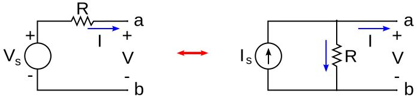
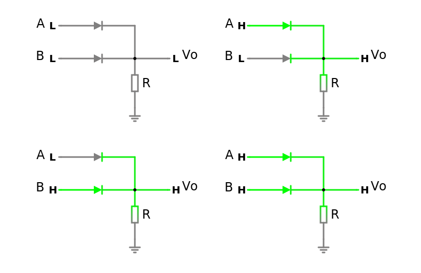
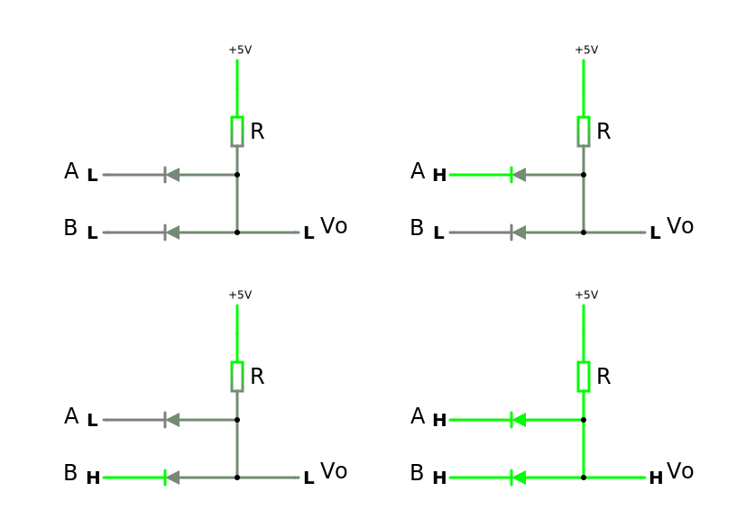

# Diodos

El primer contenido es diodo, centrado en diodo *Zener* y *Schottky*, modelos, Análisis de Circuitos con Diodos (características de transferencia): recortadores. Detectores y fijadores de voltaje, rectificadores de media onda y de onda completa. Fuentes de alimentación no reguladas (filtraje). Fuentes de alimentación reguladas con diodo Zener.

## Ejercicios

Inserte Ejercicios Durante el Semestre

---

## Parcial

### 1. Determine la Función de transferencia $Vo = f(Vi)$ y grafique $Vo = f(Vi)$ y $Vo(t),{0,T}$

Donde $Vi$ se describe como una señal triangular de periodo $T$ de $8ms$ y Tension Pico-Pico $Vpp$ de $20v$.

Respuesta

**Simplificación**

El primera paso es simplificar el circuito si es posible. El teorema de Thevenin nos dice:

> [!NOTE]
> "Cualquier red eléctrica lineal que contenga únicamente fuentes de tensión, fuentes de corriente y resistencias puede sustituirse en los terminales A–B por una combinación equivalente de una fuente de tensión $V_{th}$ en una conexión en serie con una resistencia $R_{th}$".

Lo que significa que si una parte del circuito comprendida por dos terminales es independiente de la otra parte y solo contiene elementos lineales se puede simplificar por un equivalente de Thevenin.

En este caso como no tenemos fuentes dependientes podemos tomar el lado derecho del circuito de manera sencilla. Determinando la tension entre los terminales del circuito separado, con $Vi$ como constante, se obtiene $V_{th}$. Apagando las fuente del circuito y calculando la resistencia equivalente entre sus terminales se obtiene $R_{th}$.

Para $V_{th}$ se puede hacer un sistema de ecuaciones para conocer el valor de tension en los terminales. Pero el circuito se puede resolver con técnicas mas sencilla. Primero se puede hacer una transformación de fuente donde una fuente de tension en serie con una resistencia tiene un equivalente con una fuente corriente en serie con una resistencia del mismo valor.

Obedeciendo las siguientes formulas

$$
\begin{align}
    Vs = R\cdot Is \\
    Is = \frac{Vs}R
\end{align}
$$

Dichas formulas son fácilmente deducibles con análisis de circuito.

Al tener todas las resistencias el mismo valor le asignaremos la constante $R$ para simplificar los cálculos. Primero transformamos la fuente $Vi$ que esta en serie con $R1$ a su equivalente con una fuente de corriente $Ia$ de valor $Ia = Vi/R$ en paralelo con la resistencia $R1$. Ahora $R1$ y $R2$ están en paralelo y tienen el mismo valor.

> [!NOTE]
> Para $n$ resistencias en paralelo con valor $R$, su equivalente es una resistencia de valor $R/n$

Demostrando la formula general para resistencias en paralelo se tiene que

$$
\begin{align}
R_{eq} = \frac{1}{(\frac{1}R + \frac{1}R)}\\

R_{eq} = \frac{R}2
\end{align}
$$

Ahora el paralelo de $R1$ y $R2$ le asignaremos una resistencia equivalente $Ra$ de valor $R/2$. Queda la fuente $Ia$ en paralelo con resistencia $Ra$ y a su vez el serie con la resistencia $R3$. Se transforma $Ia$ junto a $Ra$ a una fuente de tension $Va$ de valor $Vi/2$ en serie con $Ra$, la cual queda en serie con $R3$, cuyo equivalente ahora es $Rb$ de valor $3R/2$. Finalmente la fuente $Va$ en serie con $Rb$ se transforma a una fuente de corriente $Ith$ de valor $Vi/(3R)$ en paralelo con con $Rb$ y con $R4$. El equivalente de $Rb$ y $R4$ es $R_{th}$ con valor $3R/5$. Lo que resulta en un equivalente de Norton, por comodidad (y para que la fuente equivalente no quede en función del valor de las resistencias) se transforma una vez mas en un equivalente de Thevenin, quedando $V_{th}$ con valor $Vi/5$.

> [!TIP]
>El objetivo de este procedimiento es poder realizar simplificaciones rápidas sin tener que plantear sistemas de ecuaciones, de manera que se pueda resolver el ejercicio con un calculadora de sencilla o mentalmente.

Lo que resulta en una $R_{th}$ de valor $600Ω$, y para un valor de tension pico pico $Vpp_th$ de $4v$ lo que se traduce en un voltaje pico $Vp_th$ de $2v$ y $-2v$ en el ciclo positivo y ciclo negativo respectivamente

**Resolución**

Para conocer el comportamiento de $Vo$ y poder graficar se analizan las 3 ramas. considerando lo siguiente.

> [!NOTE]
> Se consider un modelo de diodo simplificado donde el diodo conduce corriente en polarización directa cuando la tension entre sus terminales alcanza una tension $Vk$, equivalente a una fuente de tension polarizada inversamente. Y cuando la tension entre sus terminales no alcanza la corriente de polarización o esta polarizada inversamente se comporta como un circuito abierto.

> [!NOTE]
> Al no estar indicado en el ejercicio se asumen diodos de silicio con valor $Vk = 0.7v$

> [!NOTE]
> Para los diodos Zener se tiene el mismo comportamiento con la adición que al superar el umbral de $Vz$ en polarización inversa el diodo conduce

Analizaremos el ciclo positivo y negativo de cada rama

Para la primera rama en el **ciclo positivo** para polarizar el diodo se debe superar la tension de polarización del diodo $Vk$ y ademas la tension de la fuente de $2v$, por lo que a partir de los $2.7v$ el diodo conduce. Para el **ciclo negativo** el diodo no conduce

Para la segunda rama en el **ciclo positivo** el diodo no conduce, y en el **ciclo negativo** a partir de los $-2.7v$ el diodo conduce, después de superar la tension de polarización del diodo y de la fuente de tension.

> [!TIP]
> se denota que la simetría inversa que poseen las primeras dos ramas

Para la tercera rama el diodo Zener en el **ciclo positivo** al superar los $0.7v$ el diodo conduce y para el **ciclo negativo** a partir de los $-5v$ el diodo conduce.

Ya que la fuente de tension $V_{th}$ suministra una tension pico de $±2v$ la primera y segunda rama nunca conducen ya que no exceden la tension de $2.7v$ requerida para polarizar los diodos.

Esto simplifica el análisis a la tercera rama que nunca conduce el en ciclo negativo, pero si en el positivo.

queda la siguiente ecuación

*Cuando D1 y D2 no conducen, D3 si conduce:*

$$
\begin{align}
\frac{Vi}5 = I\cdot R_{th} + I\cdot R_{D3} + 0.7\\

I = (Vi - 3.5v)/13k
\end{align}
$$
lo que indica que cuando $Vi > 3.5$ hay corriente atravez de $D3$

para $Vo$ cuando $D3$ conduce

$$
\begin{align}
Vo = I\cdot R_{D3} - Vi\\

Vo = \frac{2Vi}{13} + 21/130
\end{align}
$$

*Cuando D1, D2 y D3 no conducen*

Al no haber corriente no hay caída te tension en $R_{th}$ por lo que

$$
Vo = \frac{Vi}5
$$

*Vo*

$$
V_o = \begin{cases} 
    \frac{V_i}{5}, & \text{si } -10 \le V_i \le 3.5 \\
    \frac{2V_i}{13} + \frac{21}{130}, & \text{si } 3.5 < V_i \le 10 
\end{cases}
$$

### 2. Determine que compuerta lógica digital forman estos circuitos, considere A y B entradas lógicas.
$1 = 5v (H)$ ; $0 = 0v (L)$

> a. Analice tomando diodos ideales

*a*

*b*

> b. Si los diodos fueran de silicio siguen funcionando ambas compuertas?

Respuesta

Análisis Para determinar el tipo de compuerta simplemente se realiza la tabla de la verdad para cada caso tomando $A$ y $B$ como entrada y $V_o$ como salida.

*a*

<table>
    <tr>
        <td>A</td>
        <td>B</td>
        <td>Vod</td>
        <td>Vo</td>
    </tr>
    <tr>
        <td>0</td>
        <td>0</td>
        <td>0</td>
        <td>0v</td>
    </tr>
    <tr>
        <td>1</td>
        <td>0</td>
        <td>1</td>
        <td>5v</td>
    </tr>
    <tr>
        <td>0</td>
        <td>1</td>
        <td>1</td>
        <td>5v</td>
    </tr>
    <tr>
        <td>1</td>
        <td>1</td>
        <td>1</td>
        <td>5v</td>
    </tr>
</table>

Cuando $A$ **o** $B$ es $1$ $V_o$ es $1$ ($5v$ analógico) por lo que la primera compuerta es una compuerta **OR**

*b*

<table>
    <tr>
        <td>A</td>
        <td>B</td>
        <td>Vod</td>
        <td>Vo</td>
    </tr>
    <tr>
        <td>0</td>
        <td>0</td>
        <td>0</td>
        <td>0v</td>
    </tr>
    <tr>
        <td>1</td>
        <td>0</td>
        <td>0</td>
        <td>0v</td>
    </tr>
    <tr>
        <td>0</td>
        <td>1</td>
        <td>0</td>
        <td>0v</td>
    </tr>
    <tr>
        <td>1</td>
        <td>1</td>
        <td>1</td>
        <td>5v</td>
    </tr>
</table>

Cuando $A$ **y** $B$ es $1$ $V_o$ es $1$ ($5v$ analógico) por lo que la segunda compuerta es una compuerta **AND**

Si los diodos fueran de silicio tomando el modelo simplificado del diodo, en el caso `a` si alguna de las entradas fuese asertiva ($1$ o $5v$) habría una caída de tension en el diodo de $0.7v$ por lo que la tabla de la verdad quedaría

<table>
    <tr>
        <td>A</td>
        <td>B</td>
        <td>Vo</td>
    </tr>
    <tr>
        <td>0</td>
        <td>0</td>
        <td>0v</td>
    </tr>
    <tr>
        <td>1</td>
        <td>0</td>
        <td>4.3v</td>
    </tr>
    <tr>
        <td>0</td>
        <td>1</td>
        <td>4.3v</td>
    </tr>
    <tr>
        <td>1</td>
        <td>1</td>
        <td>4.3v</td>
    </tr>
</table>

En el caso de la compuerta `b` si alguna entrada es $0v$ la corriente va desde la alimentación, a través de la resistencia y cae a través de uno de los diodos, por lo que respecto a tierra habría una diferencia de potencial de $0.7v$. si ambas entradas son asertivas la tension seria de $5v$.

<table>
    <tr>
        <td>A</td>
        <td>B</td>
        <td>Vo</td>
    </tr>
    <tr>
        <td>0</td>
        <td>0</td>
        <td>0.7v</td>
    </tr>
    <tr>
        <td>1</td>
        <td>0</td>
        <td>0.7v</td>
    </tr>
    <tr>
        <td>0</td>
        <td>1</td>
        <td>0.7v</td>
    </tr>
    <tr>
        <td>1</td>
        <td>1</td>
        <td>5v</td>
    </tr>
</table>

El umbral entre un $1$ y $0$ lógico viene definido por la tecnología de dicha compuerta, tanto para la tecnología TTL y CMOS, cumplen para los valores de entrada (es decir para la tension aplicada a la entrada de otra compuerta), pero no cumple con las especificaciones de margenes de ruido para la tension de salida, de la misma.

> [!NOTE]
> [1] J. F. Wakerly, Diseño Digital. Pearson Educación, 2001.

A términos de un circuito digital podemos decir que sigue funcionando como compuerta, mas no cumple con las especificaciones TTL y CMOS.

### 3. Una fuente DC esta formada por un transformador de relación $10:1$, un puente rectificador de diodos soportan un max $2A$, un condensador de $47\mu F$ y una carga de $10K\Omega$.
> a. Dibuje el circuito para que la salida sea positiva. Determine el valor de Vo y el voltaje de rizo, sabiendo que $Vr=\frac{4V_o}{fcr}$

> b. Que cambio realizaría al circuito para que la tension a la salida sea un voltaje negativo de -5v

> c. que ocurre si el capacitor a la salida tiene un valor muy pequeño

Respuesta

> [!NOTE]
> La fuente recibe a la entrada $120v_{rms}\space⏦$ AC a $60hz$
> [!NOTE]
> Se toman todos los diodos bajo el modelo simplificado, con diodos de silicio

Para calcular $Vo$ vamos desde la entrada la fuente de tension $120v_{rms}\space⏦$, tomamos el transformador de manera ideal cumpliendo la siguiente relación.

$$

\frac{V_p}{V_s}=\frac{n_p}{n_s}

$$

Formula que relaciona la tension con el numero de espiras entre el primario y secundario del transformador. deducible a través de la ley de Faraday.

lo que despejado deja que
$$

V_s=\frac{n_s\cdot V_p}{n_p}\\
V_s=12v_{rms}

$$

en base a la tension RMS ($V_{rms}$) o eficaz ($V_{efz}$) podemos obtener la tension pico ${V_p}$ del transformador.

$$

 V_{efz}=\sqrt{\frac{1}{T}\cdot \int_{t_0}^{T}{v{^2}(t)dt}}

$$

lo que para una señal de función senoidal es

$$

V_{efz} = \frac{v_p}{\sqrt2}\\
V_{efz}\cdot \sqrt2 = v_p\\
v_p=12\sqrt2

$$

en el **ciclo positivo** a la salida del transformador la corriente fluye a través $D_1$ hasta el paralelo del capacitor y la carga (resistiva) y devuelta por el diodo $D_3$ hasta el secundario. En el **ciclo negativo** a la salida del transformador la corriente fluye a través $D_4$ hasta el paralelo del capacitor y la carga (resistiva) y devuelta por el diodo $D_2$ hasta el secundario.
En ambos ciclos, la tension del secundario del transformador debe superar la tension de polarización de dos diodos, por lo que cuando la tension (del secundario) es mayor $±1.4v$ ambos diodos conducen, sabiendo la caída de tension de los diodos tenemos que:

$$

V_{o_p} = v_p - 2\cdot V_d\\
V_{o_p} = 12\sqrt2 -1.4v\\
V_{o_p} \approx 15.57v

$$

Tomando $V_o$ como el voltaje pico a la salida. tenemos la ecuación de voltaje de rizo

$$
V_r=\frac{4V_{o_p}}{f\cdot c\cdot r}
$$

la frecuencia de la fuente de tension es $60hz$ el transformador bajo el modelo ideal no se ve afectado por la frecuencia y no cambia la misma a su salida. Al pasar por el puente rectificador para el ciclo positivo y el ciclo negativo del transformador, a la salida del puente rectificador se da la misma onda en la misma dirección, por lo que la frecuencia se duplica.

$$
f_{V_o}=120hz
$$

ya con estos valores tenemos que 

$$
V_r=\frac{40\sqrt2}{47}\approx 1.2035v
$$

Para obtener el voltaje de salida tomamos el valor pico menos la mitad del voltaje de rizo, con la notación de ± la mitad del voltaje rizo

$$

V_o = \left(V_{o_p}-\frac{V_r}2\right)±\frac{V_r}2\\
V_o \approx 14.4987 ± 0.6017

$$

Para obtener un voltaje de $-5v$ (se tomara como voltaje pico) se pueden hacer utilizar varios métodos (sin alterar los elementos ya existente). Demostraremos dos métodos.

*Primer método*

el primer método consiste en utilizar un divisor de tension capacitivo a la entrada.

tomando la referencia (tierra) como el cátodo de los diodos $D_1$ y $D_4$ se obtiene voltaje negativo respecto a la tierra. Como aclaratoria invertir el puente rectificador generaría el mismo circuito.

La tension $V_{o_p}$ es 5v, la tension que cae en el puente rectificador es de $1.4v$ por lo que la en los terminales del secundario tenemos $6.4v$, ya que la relación del transformador es $10:1$ (a través de la formula de relación de transformación) el voltaje pico a en el primario del transformador es $64v$ con un voltaje eficaz de $64/\sqrt2$.

Un divisor de tension viene dado por la siguiente expresión:

$$$

V

$$$

---