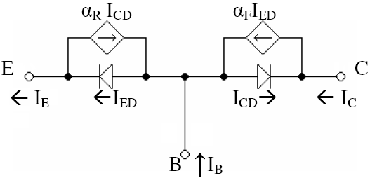
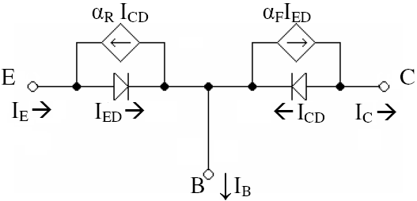

# Modelo de Ebers-Moll

> [!NOTE]
> Esta deducción busca modelar el transistor con el comportamiento conocido del mismo, no describir el comportamiento del transistor con el modelo

Un transistor BJT consiste en la union de tres materiales semiconductores (NPN o PNP), para corriente continua y pequeña señal se puede modelar como un par de diodos y fuentes de corriente, para ello partimos del **Modelo de Shockley** para el diodo

$$
I_D=I_S(e^\frac{V_D}{n\cdot V_T}-1)
$$

Donde

* **$I_D$:**    Corriente del Diodo
* **$I_S$:**    Corriente de saturación ($~10^{-12}A$)
* **$V_D$:**    Tension en los terminales del Diodo
* **$V_T$:**    Voltaje Térmico ($~26mV$ a 27°C)
* **$n$:**      Coeficiente de Emisión (entre 1 y 2)

El transistor se puede modelar asi mismo como dos diodos (al ser estos la union de dos materiales semiconductores), pero también hay que considerar la proporción de corriente que pasa de *colector* a través de la base hasta el *emisor* (forward) $\alpha_R$ y en reversa (reverse) $\alpha_F$

*NPN*

*PNP*

Obtenemos cada corriente para el modelo NPN

$$
\begin{gather}
I_E=I_{E_S}(e^\frac{V_{BE}}{n\cdot V_T}-1)-\alpha_R\cdot I_{C_S}(e^\frac{V_{BC}}{n\cdot V_T}-1)\tag{a}\\
I_C=\alpha_F\cdot I_{E_S}(e^\frac{V_{BE}}{n\cdot V_T}-1)-I_{C_S}(e^\frac{V_{BC}}{n\cdot V_T}-1)\tag{b}
\end{gather}
$$

Donde

$$
\begin{equation}
\begin{split}
\alpha_F&=\frac{I_C}{I_E}\\
&=\frac{\beta_F}{\beta_F+1}\\
\beta_F&=\frac{I_C}{I_B}\\
&=\frac{\alpha_F}{1-\alpha_F}
\end{split}
\end{equation}
$$

Tomando $\beta_F$ como el parámetro $h_{fe}$

Modelando el transistor para su funcionamiento en las zonas de corte, zona de saturación y zona lineal. Donde para un transistor NPN la tension $V_{BE}$ es positiva y la tension $V_BC$ es negativa. Por lo que para el segundo termino de las Ec. (a) y (b) el exponencial siempre toma valores entre 0 y 1. Sin importar que tan grande o pequeño sea $V_{BC}$

> [!NOTE]
> $a^0=1$ donde $0$ representa un numero arbitrariamente pequeño
> $a^{-\infty}=0$ donde $\infty$ representa un numero arbitrariamente grande

$$
\begin{equation}
\begin{split}
\lim\limits_{V_{BC}\to 0} I_{C_S}(e^\frac{V_{BC}}{n\cdot V_T}-1) &= I_{C_S}(0)\\
\lim\limits_{V_{BC}\to \infty} I_{C_S}(e^\frac{V_{BC}}{n\cdot V_T}-1) &= I_{C_S}(-1)
\end{split}
\end{equation}
$$

Al ser $I_S$ una corriente del orden de los pico amperios $10^-12$ el segundo termino se vuelve despreciable

$$
\begin{gather}
I_E\approx I_{E_S}(e^\frac{V_{BE}}{n\cdot V_T}-1)\\
I_C\approx\alpha_F\cdot I_{E_S}(e^\frac{V_{BE}}{n\cdot V_T}-1)
\end{gather}
$$

<!-- para muchos casos $I_E\approx IC$ al ser $I_B<<IC$ por lo que el parámetro $\alpha_F$ es aproximadamente 1 -->

Si consideramos útiles toda corriente ($I_E$) $>1\mu A$ tenemos lo siguiente

Si $I_D=I_S\cdot X$ donde $X=e^\frac{V_{BE}}{n\cdot V_T}-1$ entonces $1\mu=1p\cdot X \to X=1M$ por lo que el termino exponencial debe ser $1M-1$, lo cual es mucho mayor a 1. Con esta analogía esta simplificación sirve para cualquier corriente $I_D>>I_S$

:::details Demostración exhaustiva
$$
\begin{gather}
1\mu\approx I_{E_S}(e^\frac{V_{BE}}{n\cdot V_T}-1)\\
n = 1 \to V_{BE}\approx0.3592\\
n = 2 \to V_{BE}\approx0.7184
\end{gather}
$$

por lo que para con el exponencial para ambos casos tenemos que

$$
e^\frac{V_{BE}}{n\cdot V_T} = 1000001
$$

por lo que para el termino $(e^\frac{V_{BE}}{n\cdot V_T}-1)$ $e^\frac{V_{BE}}{n\cdot V_T}>>1$ por lo que podemos simplificar dicho termino.
:::

$$
\begin{gather}
I_E\approx I_{E_S}\cdot e^\frac{V_{BE}}{n\cdot V_T}\\
I_C\approx\alpha_F\cdot I_{E_S}\cdot e^\frac{V_{BE}}{n\cdot V_T}
\end{gather}
$$