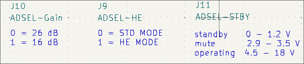
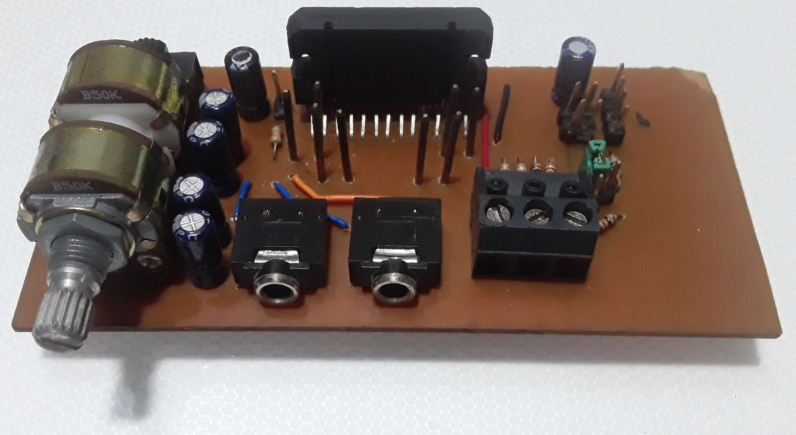

<!-- 3D Render
https://drive.google.com/uc?export=download&id=1YYRwUi6bhpO5MCbWv3B6JMYoDCnsvqHo
Blog/Kicad/img/TDA75610.png
 -->

# TDA75610 Development Board (Placa de desarrollo)

El objetivo es el desarrollo de un PCB que sirva para utilizar y depurar el integrado TDA75610LV (montaje horizontal), que se pueda imprimir en una PCB de una cara.

[Repo](https://github.com/jackestar/TDA75610)

## Requisitos

* PCB de 1 cara
* Alimentación externa (Vcc-GND)
* Alimentación integrada para control con microcontrolador (+5v)
* Control por Pines y por I2C

## Alimentación

Para los datos en el datasheet del TDA75610 el circuito puede operar de 6.5v a 18v (16v para $R_L=2\Omega$)

Para la entrada se utiliza un conector Molex Fit Jr 2x2, se coloco protección contra polaridad inversa con un diodo con su respectivo filtrado con capacitores. Para la alimentación del microcontrolador de control se utilizo un AZ1117-ADJ (un AZ1117-5.0 puede simplificar el circuito, se utilizo la version ADJ por disponibilidad) regulador LDO. Este puede suministra 1A para una tension de entrada de 15v en su configuración típica, como se esperan tensiones de hasta 18v estando este por debajo del máximo absoluto de 20v se coloca una resistencia $R1$ de $5\Omega$ a la entrada para reducir la tension de entrada para cargas de corriente grandes. el valor de $R1$ se estima con la tension minima de alimentación del TDA menos la tension de Dropout del regulador y la corriente maxima.

El regulador se ajusta ~5v

$$
V_{Out}=V{Ref}\cdot(1+R_2/R_1)+I_{Adj}\cdot R_2
$$

Con $R_1=330\Omega$, $R_2=1k\Omega$, $V_{Ref}=1.25V$ y $I_{Adj}=120\mu A$ (Despreciable)

Dando una tension en el peor de los casos de $5.1578v$. con este valor se obtuvo $R_{1_{max}}$. (La caída de tension minima que puede generar la resistencia)

$$
\frac{V_{TDA_{min}}-V_{Ref_{max}}}{I_{max}}=5.23\approx 5\Omega
$$

Para los capacitores se utilizo capacitores de tantalio como lo recomienda el datasheet

## Entrada de Audio

El TDA75610 posee cuatro canales, por lo que se utilizo dos puertos jack de entrada que pueden ser puenteados entre si para seleccionar entre 2 y 4 canales. Para ajustar el volumen se utilizo 4 potenciómetros con eje común.

## Control

El TDA permite realizar control a través de I2C y por una serie de pines de control. Para seleccionar es que modo se hace el control se utilizo un dip-switch SMD, al cerrar el switch SW2 4-5, tomando por defecto la dirección 101100x, para otras direcciones se cambia el valor de R7 acorde al DataSheet del TDA. para las resistencias de pull-up I2C cerrar el switch SW2 1-8 y 2-7 y dejar J10 y J9 estrictamente abierto. Si el control I2C esta desactivado (SW2 4-5 abierto) el control se hace a través de los pines J10, J9 y J11, cerrando SW2 1-8, 2-7 y 3-6, controlando ganancia, modo de alta eficiencia (High Efficiency) y Standby-Mute-Operación respectivamente.

La salida para el Clip detector es de colector abierto por lo que debe tener una resistencia de Push-Up

## Esquemático

[Esquemático](https://drive.google.com/file/d/1zOZ_QLpb7rlT-NX607TR__lV9A5XwjoH/view?usp=sharing)

## Modelo 3D

<ClientOnly>
  <Viewer3D modelUrl="models/TDA75610.glb" :previewImg="previewImg" />
</ClientOnly>

## Resultado

