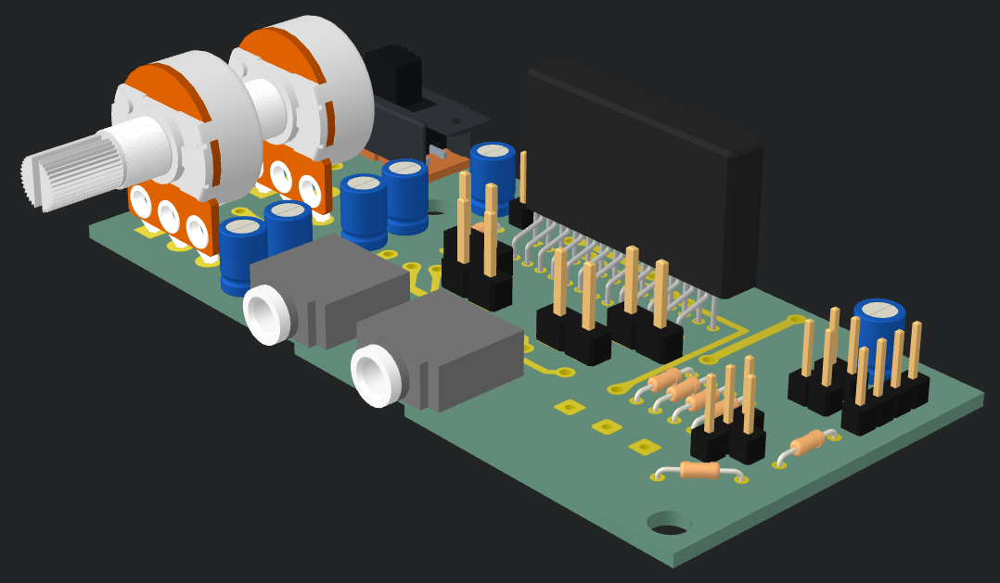
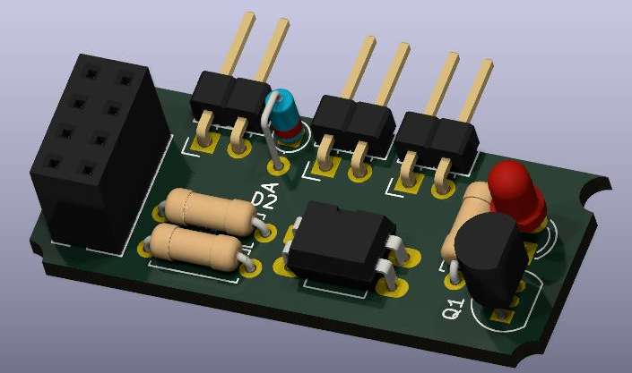
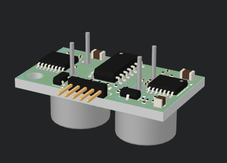

# Proyectos y Herramientas para Kicad

## PCBs

<!-- Template -->
<!-- 

### Title

Description

[Ver](./)
[Repo](./)

 -->

### TDA75610 Development Board

Placa de desarrollo para Amplificador Integrado TDA75610

[Ver](TDA75610.md)
[Repo](https://github.com/jackestar/TDA75610)

### ESP01S Kitchen Driver

Opto Aislador para driver de Cocina, con ESP01S

[Ver](ESP01S-Kitchen-Driver.md)
[Repo](https://github.com/jackestar/ESP01S-Kitchen/)

### Sensor Ultrasonido

Sensor de Ultrasonido Compacto

[Ver](./ultrasonic.md)
[Repo](https://github.com/jackestar/mini-ultrasonic)

## Herramientas

[Esquemático a SVG Consola](schematicToSVG.md)