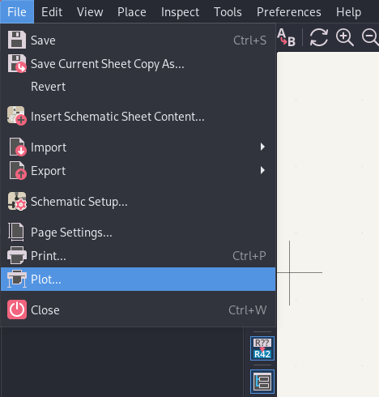
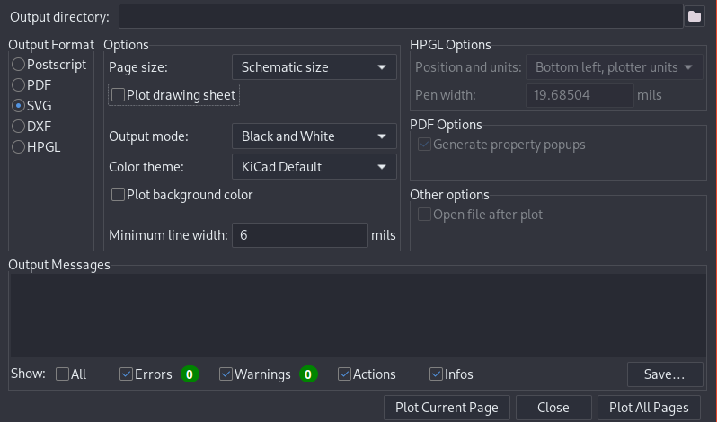

# Exportar esquemático de Kicad a SVG

Para exportar un diagrama de circuito de Kicad a formato SVG sin los margenes de forma rápida

## Exportar Plot (CLI) (Recomendado)

Utilizando `kicad-cli`

<div class='console'>

```bash
kicad-cli sch export svg --exclude-drawing-sheet proyecto.kicad_sch -o salida.svg
```

</div>

Donde `proyecto.kicad_sch` es la ubicación y nombre del proyecto de kicad y `salida.svg` es la imagen de salida

Pudiendo modificar la salida con los siguientes atributos

* `--black-and-white`: Plot en blanco y negro
* `--theme <tema>`: Establecer un tema
* `--no-background-color`: (predeterminado) no exportar el color de fondo

## Exportar Plot (GUI)

<!-- ✘✔ -->

```
File > Plot
    "Plot Schematic Options"
    Output Format = SVG
    Options
        Page Size = Schematic Size
        Plot Drawing Sheet = ✘
Plot Current Page
```

 

Selecciona el menu `File` y selecciona el item `Plot...`.  En la sección de `Output Format` selecciona `SVG`, en la sección 'Options' desmarca el checkbox `Plot Drawing Sheet`. Presiona el botón `Plot Current Page`

> [!NOTE]
> por defecto la imagen se guarda en el directorio del proyecto de Kicad

**Resultado**


## Ajustar al contenido (Inkscape por consola) (Recomendado)

Al exportar un plot en Kicad este queda con el tamaño de la hoja, para no tener que establecer los margenes en Kicad por cada circuito se puede usar la linea de comandos de Inkscape

<div class='console'>

```bash
inkscape --export-type=svg --export-plain-svg --export-area-drawing input.svg -o output.svg
```

</div>

Donde `input.svg` es el archivo original generado por Kicad, y output.svg es la salida

**Resultado**


## Ajustar al contenido (Inkscape)

Abre la imagen generada por Kicad presiona `Ctrl`+`Mayus`+`D` para abrir las `Propiedades del Documento` (Document Properties) y selecciona `Ajustar al Contenido` (Resize to Content), Luego exporta la imagen como un SVG plano  presionando `Ctrl`+`Mayus`+`E` y seleccionando `SVG plano *.svg` (Plain SVG *.svg) y finalmente exportando

## Referencias

[Kicad - Schematic SVG export](https://docs.kicad.org/8.0/en/cli/cli.html#schematic_svg_export)

[Inkscape Wiki - Using the Command Line](https://wiki.inkscape.org/wiki/Using_the_Command_Line)