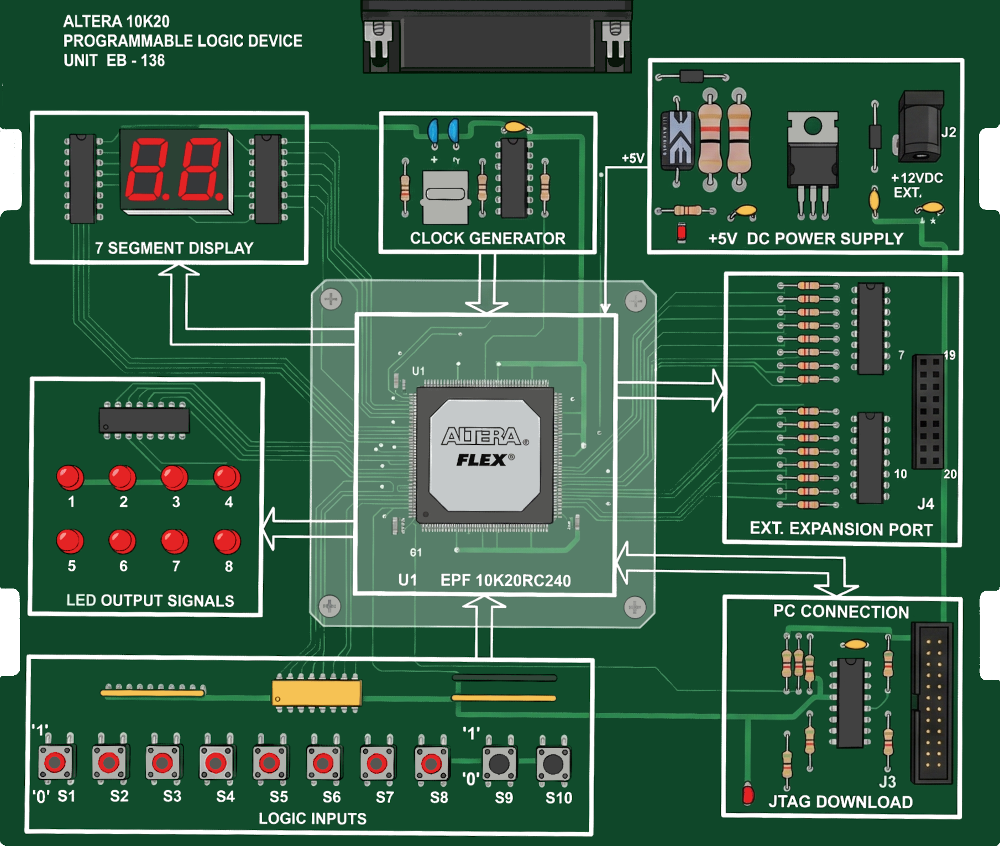
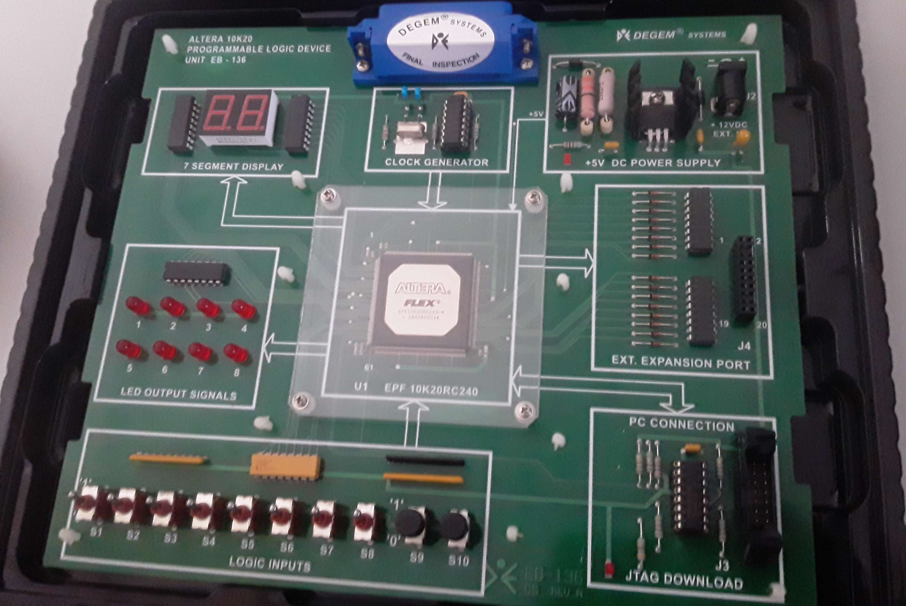

# EB-136 (EB-2000 Library)

Modulo educativo (tarjeta de entrenamiento) de DEGEM Systems que permitía introducir tecnologías en el area de la electronica, los módulos se conectaban a una estación, que proporcionaba alimentación y conexión a una computadora. En concreto el modulo EB-136 contiene un EPLD Altera de la serie Flex10K ([EPF 10K20RC240](https://drive.google.com/file/d/1soYrwAFz9p-wyJhKWJ2uO9ys7FsdQm1x/view))

## Obsolescencia de la Plataforma

La serie Flex10k de altera fue lanzada en 1998, la ultima revision de datasheet es del 2003, la ultima version del software compatible se remonta al 2003. En el 2021 intel descontinuo el soporte de software y documentación, esto significa que el software, librerías, documentación, datasheet y foros ya no están disponibles. La plataforma en si es posee muy poca información en sitios como YouTube (fundado en el 2005), Blogs y foros, incluso en la Wayback Machine, no se encuentra mucha información.

Lo mismos ocurre con la EB-2000 Library, de la plataforma se encuentran laboratorios para alguno de los módulos pero nada del EB-136 (EPLD).

El principal inconveniente es el mapeo de puertos en el modulo

## Hardware (modulo EB-136)

La tarjeta contiene el EPLD EPF 10K20RC240, alimentación externa 12VDC, Puerto de Expansion, Programador por JTAG, Reloj 4 MHz (pin 211). Entradas lógicas 8 Interruptores y 2 Pulsadores (NC/NO),8 Leds para señales de salida y 2 display 7 segmentos.

### Bloque de Entradas Lógicas (Logic Inputs)

| Nro Entrada Lógica | Tipo | Puerto CPLD |
| --- | --- | --- |
| S1 | Interruptor | 45 |
| S2 | Interruptor | 46 |
| S3 | Interruptor | 48 |
| S4 | Interruptor | 49 |
| S5 | Interruptor | 50 |
| S6 | Interruptor | 51 |
| S7 | Interruptor | 53 |
| S8 | Interruptor | 54 |
| S9 NC | Pulsador | 30 |
| S9 NO | Pulsador | 31 |
| S10 NC | Pulsador | 51 |
| S10 NO | Pulsador | 56 |

### Bloque de Leds de Señales de Salida

| Nro Led | Puerto CPLD |
| --- | --- |
| 1 | 33 |
| 2 | 34 |
| 3 | 35 |
| 4 | 36 |
| 5 | 38 |
| 6 | 39 |
| 7 | 40 |
| 8 | 41 |

### Bloque de 7 Segmentos

| Segmento | Dígito | Puerto CPLD |
|---|---|---|
| A | 1 | 06 |
| B | 1 | 07 |
| C | 1 | 08 |
| D | 1 | 09 |
| E | 1 | 11 |
| F | 1 | 12 |
| G | 1 | 13 |
| A | 2 | 17 |
| B | 2 | 18 |
| C | 2 | 19 |
| D | 2 | 20 |
| E | 2 | 21 |
| F | 2 | 23 |
| G | 2 | 24 |

*\* Pull up y Lógica negativa*

### JTAG

| Nombre    | Descripción | Pin  JTAG |
| --- | --- | --- |
| TD0   | Salida de datos de prueba | 1 |
| GND   | Conexión de común | 2 |
| TCK   |- Primera entrada diferencial de entrada de reloj | 3 |
| TCK   |+ Segunda entrada diferencial de entrada de reloj | 4 |
| GND   | Conexión de común | 5 |
| TMS   |+ Primera entrada diferencial de modo de prueba | 6 |
| TMS   |- Segunda entrada diferencial de modo de prueba | 7 |
| GND   | Conexión de común | 8 |
| TDI   |- Entrada de datos de prueba | 9 |
| TDI   |+ Entrada de datos de prueba | 10 |
| GND   | Conexión de común | 11 |
| +5V   | Fuente de alimentación | 12 |
| GND   | Conexión de común | 13 |
| GND   | Conexión de común | 14 |

### Puerto de Expansion

| I/O | Descripción | Pin EPLD | Pin Puerto |
| --- | --- | --- | --- |
| 1 | I/O bidireccional | 144 | 1 |
| 2 | I/O bidireccional | 143 | 2 |
| 3 | I/O bidireccional | 142 | 3 |
| 4 | I/O bidireccional | 141 | 4 |
| 5 | I/O bidireccional | 139 | 5 |
| 6 | I/O bidireccional | 138 | 6 |
| 7 | I/O bidireccional | 137 | 7 |
| 8 | I/O bidireccional | 136 | 8 |
| 9 | I/O bidireccional | 134 | 9 |
| 10 | I/O bidireccional | 133 | 10 |
| 11 | I/O bidireccional | 132 | 11 |
| 12 | I/O bidireccional | 131 | 12 |
| 13 | I/O bidireccional | 129 | 13 |
| 14 | I/O bidireccional | 128 | 14 |
| 15 | I/O bidireccional | 127 | 15 |
| 16 | I/O bidireccional | 126 | 16 |
| +5V | Alimentación a circuitos externos* | N/A | 17, 18
| Ground | Común | N/A | 19,20 |

\*puede suministrar más de 120 mA a circuitos externos

## Software

Para programar dicha EPLD la tarjeta de entrenamiento cuenta con un puerto JTAG y un programador ByteBlaster MV, esta se programa con el software MAX+Plus II.

::: info
El ByteBlaster MV, utiliza el puerto parallel, algunas motherboards requieren configurar el puerto para dicho uso (EPP (Enhanced Parallel Port)), la instalación manual del dispositivo y establecer explícitamente dicho programador (Auto-setup o Self-test pueden no ser de ayuda)
:::

::: info 
la version 10.0.9 (standalone) se ejecuta sin problemas en Linux mediante Wine, el instalador de la ultima version no se ejecuta propiamente
:::

## Referencias

[Datasheet EPF 10K20RC240](https://drive.google.com/file/d/1soYrwAFz9p-wyJhKWJ2uO9ys7FsdQm1x/view)

[MANUAL DEL INSTRUCTOR EB-136](https://drive.google.com/drive/folders/1uCWnO3n90lK7uyjUbklQ1wFFUTVIjm1i)

::: info
Existe muy poca si no es que nula información en internet que este indexada o siquiera disponible para este modulo de la EB-2000, la plataforma no solo obsoleta si no removida de todo foro oficial dificulta su uso
:::